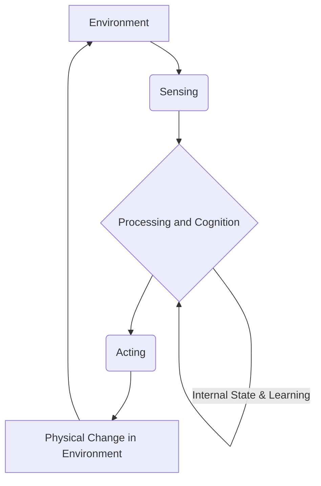

# Embodied Intelligence: The Perception-Action Loop

In the rapidly evolving landscape of Physical AI and robotics, understanding how intelligent systems interact with their environment is paramount. This chapter delves into the concept of **Embodied Intelligence** and its foundational mechanism: the **Perception-Action Loop**. We will explore how robots and other autonomous systems sense their surroundings, process that information, and generate physical responses, creating a continuous, dynamic interaction that defines their intelligence.

## 1. Introduction to Embodied Intelligence

Embodied intelligence is a paradigm in artificial intelligence that posits that an agent's intelligence is not solely a product of its abstract reasoning abilities, but is fundamentally shaped by its physical body and its interactions with the real world. Unlike traditional, "disembodied" AI systems that operate primarily in abstract, symbolic domains (e.g., game-playing AI, natural language processors), embodied AI systems are instantiated in physical forms—robots, autonomous vehicles, drones, or even simulated agents with physical characteristics.

The core idea is that the body is not just a passive vessel for the brain, but an active participant in cognitive processes. The physical structure, sensory capabilities, and motor skills of an embodied agent profoundly influence how it perceives, thinks, learns, and behaves. For instance, a robot designed with wheels will perceive and interact with its environment differently than one with legs, leading to distinct cognitive strategies for navigation and obstacle avoidance.

The significance of embodied intelligence in Physical AI cannot be overstated. It moves beyond theoretical constructs to address the challenges of real-world engagement, where uncertainty, noise, and unexpected events are the norm. Robots with embodied intelligence are better equipped to handle unstructured environments, adapt to unforeseen circumstances, and exhibit more robust and flexible behaviors. Their intelligence emerges from the dynamic interplay between their physical form, their sensory inputs, and their motor outputs, rather than from purely internal computations.

Contrast this with **disembodied AI**, which often deals with abstract data, logical rules, and symbolic representations without direct physical interaction. While highly effective in domains like database management, expert systems, or chess, disembodied AI frequently struggles when translated to physical tasks due to the "symbol grounding problem"—how to connect abstract symbols to real-world phenomena—and the inherent complexities of continuous, analogue environments. Embodied intelligence seeks to bridge this gap by grounding intelligence in the physical reality of the agent.

:::tip Key Takeaway
Embodied Intelligence emphasizes that an agent's physical body and its real-world interactions are integral to its cognitive abilities. It contrasts with disembodied AI by focusing on dynamic, grounded intelligence necessary for robust physical autonomy.
:::

## 2. The Perception-Action Loop

At the heart of embodied intelligence lies the **Perception-Action Loop**, a fundamental concept that describes the continuous, recursive interaction between an agent and its environment. This loop illustrates how an agent's actions are informed by its perceptions, and in turn, how its actions influence subsequent perceptions, creating a feedback cycle that drives intelligent behavior. It's not a one-way street from sensing to acting, but a constant dialogue.

Imagine a humanoid robot reaching for a cup. It first **perceives** the cup's location, shape, and orientation using its cameras and depth sensors. This sensory information is then **processed** to plan a grasping motion. The robot then **acts** by moving its arm and hand towards the cup. As its arm moves, its perception continuously updates – it sees its hand approaching the cup, adjusts its trajectory based on real-time feedback (e.g., detecting an unexpected obstacle or the cup's slight movement), and refines its grip. Once the cup is grasped, the sensation of touch and pressure from its hand becomes the new perception, informing the next action, such as lifting the cup.

This continuous feedback mechanism is critical for adapting to dynamic environments and performing complex tasks. Without it, a robot would execute pre-programmed actions blindly, without the ability to correct errors or respond to changes. The perception-action loop enables agents to:

1.  **Sense (Perception)**: Gather information from the environment through various sensors.
2.  **Process/Cognition**: Interpret sensory data, make decisions, plan actions, and learn.
3.  **Act (Action)**: Execute physical responses that modify the environment or the agent's relationship to it.

Each component feeds into the next, forming a tightly coupled system where the output of one stage becomes the input for the next. The loop is not merely sequential steps but often involves concurrent and parallel processing, allowing for rapid and flexible responses.

:::tip Key Takeaway
The Perception-Action Loop is a continuous feedback cycle where an agent senses its environment, processes that information to make decisions, and then acts, with those actions in turn influencing subsequent perceptions. This dynamic interplay is crucial for adaptive and intelligent behavior in physical systems.
:::

## 3. Components of the Loop

Let's break down each essential component of the perception-action loop in more detail.

### 3.1. Sensing

Sensing is the initial gateway through which an embodied agent gathers information about its internal state and the external environment. It involves converting various physical phenomena (light, sound, pressure, temperature, distance) into electrical signals that can be processed by the agent's cognitive system. Just as humans rely on eyes, ears, and touch, robots employ a diverse array of sensors.

**Types of Sensors and Their Roles:**

*   **Vision Sensors (Cameras)**:
    *   **2D Cameras**: Provide rich visual information, allowing robots to identify objects, recognize patterns, track movement, and read text. Used for tasks like navigation, object recognition (e.g., identifying a specific tool), and human-robot interaction (e.g., recognizing facial expressions).
    *   **Depth Cameras (e.g., LiDAR, Stereo Vision, Structured Light)**: Crucial for perceiving the 3D structure of the environment. LiDAR (Light Detection and Ranging) uses laser pulses to measure distances, creating detailed point clouds of the surroundings. Stereo vision mimics human binocular vision by using two cameras to calculate depth. These are essential for obstacle avoidance, grasping objects, and creating maps of the environment.
*   **Proprioceptive Sensors**: These sensors provide information about the robot's own body state.
    *   **Encoders**: Measure the angular position or rotation of motor shafts, providing feedback on joint angles and limb positions. Essential for precise motor control and knowing where the robot's body parts are in space.
    *   **Force/Torque Sensors**: Measure forces and torques applied to parts of the robot, such as grippers or feet. Critical for tasks requiring delicate manipulation, balancing, or physical interaction with objects or humans.
    *   **Inertial Measurement Units (IMUs)**: Combine accelerometers and gyroscopes to measure orientation, angular velocity, and linear acceleration. Used for maintaining balance, estimating body pose, and navigation.
*   **Tactile Sensors (Touch Sensors)**: Detect physical contact and pressure. Often integrated into robot grippers or fingertips to provide feedback during grasping, allowing for adjustments in grip strength and object recognition through touch.
*   **Auditory Sensors (Microphones)**: Enable robots to detect sound, locate sound sources, and potentially understand spoken commands or environmental cues (e.g., a siren).
*   **Range Sensors (Ultrasonic, Infrared)**: Provide less detailed but faster distance measurements than depth cameras, useful for proximity detection and basic obstacle avoidance in close quarters.

The choice and arrangement of sensors are critical design decisions, as they directly impact the quality and quantity of information available to the robot, thereby shaping its perceptual capabilities and subsequent actions.

### 3.2. Processing and Cognition

Once sensory data is collected, the processing or cognition stage interprets this raw information, extracts meaningful features, makes decisions, and plans future actions. This is often considered the "brain" of the embodied agent.

**Key aspects of processing/cognition include:**

*   **Sensory Data Interpretation**: Raw sensor data is often noisy, incomplete, and high-dimensional. This stage involves filtering, fusion (combining data from multiple sensors for a more complete picture), and feature extraction (identifying relevant patterns, edges, colors, objects from visual data; identifying forces, positions from proprioceptive data).
*   **World Modeling**: Building an internal representation or "map" of the environment based on interpreted sensory data. This model can be static (e.g., a pre-loaded map) or dynamic (continuously updated with new sensor readings). It helps the robot understand its current location, the location of objects, and potential obstacles.
*   **Decision-Making**: Based on the world model, current goals, and internal states, the agent determines the most appropriate course of action. This can range from simple reactive behaviors (e.g., "if obstacle, then turn") to complex, deliberative planning (e.g., "plan a multi-step path to retrieve object X while avoiding dynamic obstacles"). Techniques like reinforcement learning, classical planning algorithms (e.g., A* search), and neural networks are often employed here.
*   **Learning**: Embodied agents can learn from their experiences. This includes:
    *   **Perceptual Learning**: Improving object recognition, depth estimation, or sound localization over time.
    *   **Motor Learning**: Refining motor commands for smoother, more efficient, and precise movements.
    *   **Task Learning**: Acquiring new skills or optimizing strategies for achieving goals. This can involve trial-and-error, imitation, or explicit instruction.
*   **Goal Management**: Maintaining and prioritizing a set of goals, and evaluating progress towards them. The cognitive system must decide which goal to pursue and how to break it down into achievable sub-goals.

The complexity of the processing stage varies greatly depending on the agent's intelligence level, from simple reflex-based systems to highly sophisticated cognitive architectures capable of abstract reasoning and long-term planning.

### 3.3. Acting

Acting is the final stage of the perception-action loop, where the cognitive decisions are translated into physical responses that affect the environment or the agent's state within it. This involves **actuators** and **motor control**.

**Actuators and Motor Control:**

*   **Actuators**: These are the "muscles" of the robot, devices that convert energy (electrical, pneumatic, hydraulic) into physical motion.
    *   **Electric Motors (DC, Servo, Stepper)**: Most common in robotics, used to drive wheels, articulate robot arms, open and close grippers. Servo motors offer precise control over position, while DC motors provide continuous rotation.
    *   **Pneumatic/Hydraulic Cylinders**: Used for high-force applications, often found in industrial robots or heavy machinery.
    *   **Artificial Muscles (e.g., Shape Memory Alloys, Electroactive Polymers)**: Emerging technologies that aim to mimic biological muscles, offering compliance and biomimetic movements.
*   **Motor Control**: This is the process of generating the specific electrical signals that drive the actuators to produce desired movements. It involves:
    *   **Kinematics and Dynamics**: Calculating the necessary joint angles, velocities, and torques to achieve a desired end-effector pose or trajectory.
    *   **Feedback Control**: Using sensor feedback (e.g., from encoders) to continuously adjust motor commands, ensuring that the actual movement matches the planned movement and correcting for disturbances. Common control strategies include PID (Proportional-Integral-Derivative) control.
    *   **Trajectory Generation**: Creating smooth and efficient paths for movement, considering factors like speed, acceleration, and jerk limits to prevent damage and ensure stability.
    *   **Balance and Stability**: For mobile robots or humanoids, motor control systems are crucial for maintaining balance and preventing falls, often integrating IMU data to adjust foot placement or body posture.

The quality of acting directly impacts the robot's ability to execute plans reliably and safely. Poor motor control can lead to jerky movements, missed targets, or even damage to the robot or its surroundings. The tight integration between motor control and sensory feedback is what allows for fine manipulation, robust locomotion, and adaptive interaction with the physical world.

## 4. Mermaid Flowchart

Here is a Mermaid flowchart visualizing the perception-action loop:

**Explanation of the Flowchart:**

*   **A[Environment]**: Represents the physical world surrounding the embodied agent. This is where all interactions occur and changes manifest.
*   **B(Sensing)**: The agent gathers data from the environment using its various sensors (cameras, tactile sensors, IMUs, etc.). This is the input stage of the loop.
*   **C{Processing and Cognition}**: The "brain" of the agent. This stage interprets the raw sensory data, builds a world model, makes decisions based on goals and current state, and plans actions. It also incorporates learning and maintains internal states.
*   **D(Acting)**: The agent executes its planned actions using actuators (motors, grippers, etc.). These actions translate cognitive decisions into physical movements.
*   **E[Physical Change in Environment]**: The result of the agent's actions. These changes can be subtle (e.g., slight change in robot's position) or significant (e.g., moving an object, navigating to a new location).
*   The arrow from **E** back to **A** and then **B** signifies that these physical changes in the environment become the new context for the next round of sensing, thus closing the loop and making it continuous.
*   The self-loop on **C{Processing and Cognition}** indicates that internal states, learning, and memory continuously influence and are influenced by cognitive processes within the loop.

This flowchart clearly illustrates the cyclical and interdependent nature of perception and action in embodied intelligent systems.

## 5. Importance and Implications

The perception-action loop is not just a theoretical model; it is a fundamental principle that underpins the success of autonomous systems in the real world. Its implications are profound for developing robots that are truly intelligent, adaptable, and capable of complex interactions.

**Crucial for Autonomous Systems:**

*   **Real-time Adaptability**: The continuous feedback allows autonomous systems to adjust their behavior on the fly in response to unexpected changes or uncertainties in the environment. A sudden obstacle, a slippery surface, or a moving target can all be handled because the robot is constantly re-evaluating its situation.
*   **Robustness in Dynamic Environments**: Unlike pre-programmed systems that can fail when conditions deviate, systems operating with a perception-action loop are inherently more robust. They can cope with sensor noise, actuator inaccuracies, and environmental variability, making them suitable for unstructured and unpredictable settings.
*   **Emergent Behavior**: Complex, intelligent behaviors often emerge from the simple, repeated interactions within the loop, rather than being explicitly programmed. For example, successful navigation in a cluttered environment can emerge from a combination of basic obstacle avoidance (perception) and movement (action), iteratively refined.

**Adaptability and Real-world Interaction:**

*   **Learning and Skill Acquisition**: The loop provides the necessary feedback for learning. By observing the outcomes of its actions (through new perceptions), an agent can refine its internal models, improve its decision-making strategies, and learn new skills. This is the basis for reinforcement learning in robotics, where agents learn optimal policies by trial and error.
*   **Embodied Cognition**: The loop reinforces the concept of embodied cognition, where the physical interactions with the world shape intelligence itself. The constraints and affordances of the body and environment become part of the cognitive process.
*   **Human-Robot Interaction**: For robots to interact naturally and safely with humans, they must be able to perceive human intentions, gestures, and speech, and respond appropriately. The perception-action loop facilitates this by allowing robots to continuously monitor human actions and adjust their own behavior to be cooperative or avoid collisions.

The perception-action loop moves robots beyond simple automation to genuine autonomy, enabling them to operate effectively and intelligently in environments designed for humans.

:::tip Key Takeaway
The perception-action loop is vital for autonomous systems, providing real-time adaptability, robustness, and enabling emergent behaviors. It is fundamental for learning, embodied cognition, and natural human-robot interaction in complex, dynamic environments.
:::

## 6. Challenges in the Loop

Despite its power, implementing a fully functional and robust perception-action loop in real-world robotics presents several significant challenges. These challenges often require sophisticated engineering, advanced algorithms, and careful system design.

*   **Sensor Noise and Uncertainty**: All sensors are inherently noisy and provide imperfect information. Environmental factors (lighting, reflections, fog) can further degrade sensor data. Robots must be able to filter noise, handle missing data, and reason under uncertainty, often using probabilistic methods (e.g., Kalman filters, particle filters) to maintain an accurate world model. Incorrect perceptions can lead to flawed decisions and erroneous actions.

*   **Latency and Real-time Constraints**: The entire loop—from sensing to processing to acting and back—must operate within strict real-time constraints, especially for fast-moving robots or safety-critical applications. Delays (latency) at any stage can lead to outdated information, instability, or collisions. Minimizing computational overhead, optimizing communication between components, and using high-performance hardware are crucial. A lag in processing can mean a robot perceives an obstacle too late to avoid it.

*   **Actuator Limitations and Inaccuracies**: Actuators are not perfect. They have limitations in speed, force, precision, and range of motion. Mechanical wear, friction, and environmental conditions can also introduce inaccuracies. Motor control systems must compensate for these imperfections, ensure smooth movements, and prevent overshoots or oscillations. The physical reality of the robot's body imposes fundamental limits on what actions can be executed.

*   **Complexity of World Modeling and Decision-Making**: Building an accurate and comprehensive internal model of a complex, dynamic environment is extremely challenging. This includes not only geometric mapping but also understanding object properties, semantic information, and predicting future states. Decision-making, especially for long-term planning and complex tasks, involves combinatorial explosion, requiring efficient algorithms and often heuristics or learning-based approaches to find optimal solutions in reasonable time.

*   **Skill Transfer and Generalization**: While robots can learn specific tasks, generalizing those learned skills to novel situations or environments remains a significant hurdle. A robot trained to grasp a specific type of cup on a table might struggle with a different cup, a cluttered shelf, or an uneven surface. This challenge points to the need for more robust learning algorithms that can abstract knowledge and apply it broadly.

*   **Integration and Orchestration**: Integrating diverse sensors, complex processing units, and multiple actuators into a coherent, functioning system is an immense engineering task. Ensuring all components work together seamlessly, communicate effectively, and are synchronized is critical for the overall stability and performance of the embodied system.

Addressing these challenges is at the forefront of modern robotics research and development, driving innovation in sensor technology, real-time computing, control theory, and artificial intelligence.

:::caution Common Pitfall
Overlooking sensor noise, latency, and actuator limitations can cripple an embodied system. Robust systems must account for these real-world imperfections through advanced filtering, real-time optimization, and adaptive control strategies.
:::

---