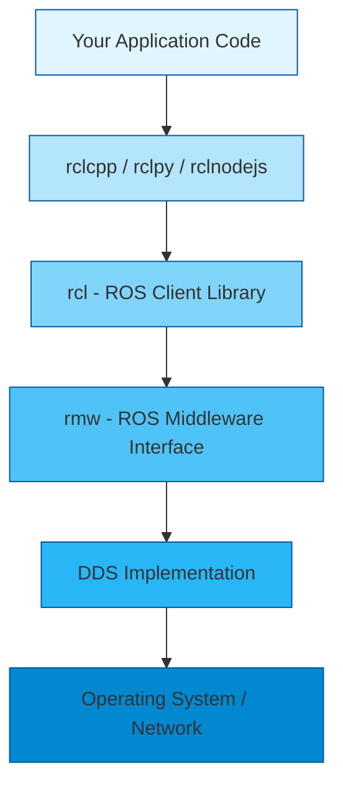
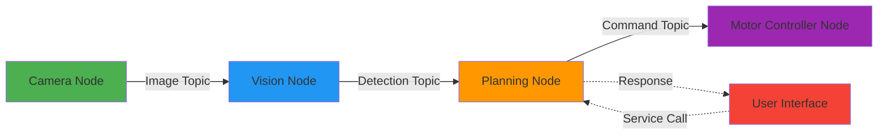

# ROS 2 Architecture and Design

When you start building physical AI systems—whether robots, drones, or autonomous vehicles—you quickly realize that managing sensor data, actuators, planning algorithms, and control systems becomes incredibly complex. How do you make dozens of different components communicate reliably? How do you ensure your vision system can send data to your navigation module in real-time? This is where ROS 2 (Robot Operating System 2) becomes essential.

ROS 2 is not an operating system in the traditional sense. Instead, it's a **middleware framework**—a sophisticated layer of software that sits between your application code and the operating system, providing tools and conventions for building distributed robotic systems. In this chapter, you'll understand ROS 2's architecture from the ground up, why it was redesigned from ROS 1, and how its layered design enables reliable robot applications.

## Why ROS 2 Exists: The Evolution from ROS 1

To appreciate ROS 2's architecture, we need to understand what came before and why a complete redesign was necessary.

### ROS 1: The Pioneer (2007-Present)

ROS 1 (originally just "ROS") was created in 2007 at Willow Garage to solve a critical problem in robotics research: every robotics lab was reinventing the wheel. Researchers spent more time building infrastructure than advancing robotics science. ROS 1 provided:

- **Standardized message passing** between different software components
- **Reusable libraries** for common tasks (navigation, manipulation, perception)
- **Tools for visualization and debugging** (RViz, rqt)
- **A thriving ecosystem** of packages and community contributions

ROS 1 became wildly successful in research. By 2015, it was the de facto standard in academic robotics and had begun entering industry.

### The Limitations of ROS 1

However, as ROS 1 moved from research labs to real-world deployments, fundamental limitations emerged:

**1. No Real-Time Guarantees**
ROS 1's communication layer couldn't guarantee message delivery times. For research, this was acceptable. For a self-driving car making split-second decisions, it was dangerous.

**2. Master Node Single Point of Failure**
ROS 1 required a "master" process that coordinated all communication. If the master crashed, the entire robot system went down. This was unacceptable for production systems.

**3. TCP-Only Communication**
ROS 1 primarily used TCP, which guarantees delivery but adds latency. Many robotics applications need the speed of UDP, accepting occasional packet loss for lower latency.

**4. Limited Multi-Robot Support**
ROS 1 wasn't designed for multiple robots to communicate easily. As swarms and multi-robot systems became important, this became a major limitation.

**5. Security Gaps**
ROS 1 had no built-in security. Messages weren't encrypted, and there was no authentication. This was fine in closed lab environments but unacceptable for commercial deployments.

**6. Platform Dependencies**
ROS 1 was designed for Ubuntu Linux. Supporting other platforms (Windows, macOS, real-time operating systems) required significant workarounds.

:::note The Breaking Point
The tipping point came when major companies (BMW, Bosch, Intel) wanted to use ROS for production systems—autonomous vehicles, industrial robots, commercial drones. ROS 1's architecture couldn't meet the reliability, security, and real-time requirements of these applications.
:::

### ROS 2: A Complete Architectural Redesign (2015-Present)

Rather than patching ROS 1's limitations, the community made a bold decision: **build ROS 2 from the ground up** with production systems in mind.

Key design goals for ROS 2:

- **Real-time capable**: Support deterministic communication with QoS (Quality of Service) policies
- **No single point of failure**: Eliminate the master node
- **Security first**: Built-in encryption, authentication, and access control
- **Platform agnostic**: Support Linux, Windows, macOS, and RTOS
- **DDS standard**: Use proven industrial middleware instead of custom protocols
- **Production ready**: Meet the needs of commercial deployments

ROS 2 launched in 2015 and reached long-term support (LTS) status with ROS 2 Humble in 2022, signaling its readiness for production use.

## The Layered Architecture of ROS 2

ROS 2's architecture consists of several layers, each building on the one below. Understanding this layered design is crucial to understanding how ROS 2 achieves its goals.



Let's explore each layer from bottom to top.

### Layer 1: DDS (Data Distribution Service)

At the foundation of ROS 2 is **DDS (Data Distribution Service)**, an industry-standard middleware specification published by the Object Management Group (OMG). DDS was developed for mission-critical systems—military applications, air traffic control, financial trading systems—where reliability and performance are paramount.

**What DDS Provides:**

**Discovery**: Nodes automatically discover each other on the network without a central server. When a new publisher appears, subscribers automatically detect it.

**Quality of Service (QoS)**: Fine-grained control over reliability, durability, latency, and other communication properties. You can specify that sensor data should prioritize low latency (accept occasional loss), while safety commands must guarantee delivery.

**Scalability**: DDS efficiently handles thousands of publishers and subscribers across networks.

**Standards-based**: Multiple commercial and open-source implementations exist (Fast-DDS, Cyclone DDS, RTI Connext), all following the same specification.

**Why DDS?**
Instead of building and maintaining custom networking code (as ROS 1 did), ROS 2 leverages decades of engineering in DDS implementations. This means ROS 2 benefits from continuous improvements in DDS without needing to reinvent the wheel.

:::tip DDS in the Real World
DDS isn't just for robotics. It powers:
- Battlefield communications in military systems
- Control systems in power plants
- High-frequency trading platforms
- Connected car infrastructure

By using DDS, ROS 2 inherits this proven reliability.
:::

### Layer 2: rmw (ROS Middleware Interface)

The **rmw** (ROS MiddleWare) layer is an abstraction that sits on top of DDS. Its purpose is simple but powerful: **allow ROS 2 to work with different DDS implementations**.

**Why This Matters:**

Different DDS implementations have different strengths:

- **Fast-DDS**: Default in ROS 2, good general-purpose performance
- **Cyclone DDS**: Excellent for resource-constrained systems
- **RTI Connext DDS**: Commercial implementation with advanced features and support

The rmw layer means you can switch DDS implementations without changing your application code. This provides:

- **Vendor independence**: No lock-in to a specific DDS provider
- **Optimization flexibility**: Choose the DDS implementation best for your use case
- **Future-proofing**: Adopt new DDS implementations as they emerge

**How It Works:**
The rmw layer defines a standard API that all DDS implementations must implement. Your ROS 2 code calls rmw functions, which translate to the specific DDS implementation you've chosen.

### Layer 3: rcl (ROS Client Library)

The **rcl** (ROS Client Library) provides the core functionality of ROS 2 in a language-agnostic way. It implements:

- **Node lifecycle management**: Creating, configuring, and destroying nodes
- **Publisher/subscriber creation**: Setting up communication endpoints
- **Service and action interfaces**: Request/response and long-running task patterns
- **Parameter management**: Configuration and reconfiguration of nodes
- **Timing and execution**: Managing callbacks and spinning

The rcl is written in C, making it portable and allowing language-specific clients to build on it.

### Layer 4: Language-Specific Client Libraries

On top of rcl sit the language-specific client libraries that you'll actually use in your code:

**rclpy (Python)**
The Python client library, built on rcl. This is what you'll use most in this course. It provides Pythonic APIs for all ROS 2 functionality.

**rclcpp (C++)**
The C++ client library, also built on rcl. Used for performance-critical components where execution speed matters most.

**rclnodejs (JavaScript/Node.js)**
For web-based robot interfaces and cloud robotics applications.

**Other languages**: Community members have created clients for Java, Rust, Ada, and more.

**Key Point**: Because all these libraries use the same rcl underneath, a Python node can seamlessly communicate with a C++ node, which can communicate with a JavaScript node. The language is just your interface to the ROS 2 system.

### Layer 5: Your Application

At the top of the stack is your application code—the perception algorithms, planning logic, control systems, and business logic that make your robot unique. This code uses the client libraries to:

- Create nodes that encapsulate functionality
- Publish and subscribe to topics to share data
- Provide and call services for request/response interactions
- Implement actions for long-running tasks

The layered architecture means you can focus on your application logic while ROS 2 handles the complexity of distributed communication, discovery, and data transport.

## The ROS 2 Computational Graph

While the layered architecture describes how ROS 2 is structured internally, the **computational graph** describes how your running ROS 2 system is organized.

### Key Concepts

**Nodes**: Independent processes that perform specific computations. A robot might have:
- A camera node that publishes images
- A vision node that processes images to detect objects
- A planning node that decides where to move
- A control node that commands motors

**Topics**: Named channels for one-way, streaming communication. Nodes publish messages to topics and subscribe to topics to receive messages. Topics use a publish-subscribe pattern.

**Messages**: Strongly-typed data structures sent over topics. ROS 2 provides standard messages (sensor data, geometry, navigation) and you can define custom messages.

**Services**: Synchronous request-response communication. A client node sends a request and waits for a response from a server node.

**Actions**: Long-running tasks with feedback. Similar to services but support intermediate feedback and cancellation.

**Parameters**: Configuration values that can be set and changed at runtime.



This graph-based architecture provides:

**Modularity**: Each node has a single, well-defined responsibility
**Reusability**: Nodes can be reused across different robots and projects
**Testability**: Nodes can be tested in isolation
**Scalability**: Nodes can be distributed across multiple machines
**Flexibility**: Swap out implementations without changing the overall system

### How the Graph Forms: Discovery Without a Master

One of ROS 2's biggest improvements over ROS 1 is **automatic discovery without a central master**. Here's how it works:

1. **Node starts**: When you launch a node, it announces its presence on the network using DDS discovery
2. **Other nodes detect it**: Existing nodes receive the announcement and learn about the new node's publishers, subscribers, services, and actions
3. **Connections form**: If a new publisher matches an existing subscriber (same topic name and message type), they automatically connect
4. **No single point of failure**: If any node crashes, others continue operating. There's no master to bring down the whole system

This peer-to-peer architecture is fundamentally more robust than ROS 1's master-based design.

## Quality of Service (QoS): Fine-Grained Communication Control

One of ROS 2's most powerful features is **QoS (Quality of Service)** policies, inherited from DDS. QoS lets you specify exactly how communication should behave.

### Key QoS Policies

**Reliability**
- **Reliable**: Guarantee message delivery (like TCP). Use for critical commands.
- **Best Effort**: Send and forget (like UDP). Use for high-frequency sensor data where occasional loss is acceptable.

**Durability**
- **Volatile**: New subscribers only receive messages published after they subscribe. Default behavior.
- **Transient Local**: New subscribers receive the last published message, even if it was sent before they subscribed. Useful for configuration data.

**History**
- **Keep Last N**: Buffer only the last N messages. If subscriber can't keep up, oldest messages are dropped.
- **Keep All**: Buffer all messages until delivered. Can cause memory issues if subscriber is too slow.

**Deadline**
- Specify maximum time between messages. If exceeded, trigger a callback. Useful for detecting failed sensors.

**Liveliness**
- Monitor if publisher is still alive. Useful for critical safety checks.

### Example: Sensor vs. Command QoS

```python title="qos_example.py" showLineNumbers
from rclpy.qos import QoSProfile, ReliabilityPolicy, HistoryPolicy

# QoS for high-frequency sensor data (e.g., LiDAR at 10Hz)
sensor_qos = QoSProfile(
    reliability=ReliabilityPolicy.BEST_EFFORT,  # Accept occasional loss
    history=HistoryPolicy.KEEP_LAST,
    depth=1  # Only care about latest reading
)

# QoS for safety-critical commands (e.g., emergency stop)
command_qos = QoSProfile(
    reliability=ReliabilityPolicy.RELIABLE,  # Must guarantee delivery
    history=HistoryPolicy.KEEP_ALL  # Can't afford to lose any command
)
```

Choosing the right QoS profile is critical for system performance and reliability. We'll explore this in depth in upcoming sections.

:::caution QoS Compatibility
For a publisher and subscriber to connect, their QoS policies must be **compatible**. A reliable publisher can't connect to a best-effort subscriber. ROS 2 will warn you about incompatible QoS matches.
:::

## ROS 1 vs. ROS 2: A Direct Comparison

Let's consolidate the key architectural differences:

| Aspect | ROS 1 | ROS 2 |
|--------|-------|-------|
| **Middleware** | Custom TCP/UDP | DDS (standardized) |
| **Discovery** | Requires master node | Peer-to-peer (no master) |
| **Reliability** | Single point of failure | No single point of failure |
| **Real-time** | Not real-time capable | Real-time capable with QoS |
| **Security** | No built-in security | DDS Security (encryption, authentication) |
| **Platforms** | Primarily Ubuntu Linux | Linux, Windows, macOS, RTOS |
| **Languages** | Python, C++ (Lisp deprecated) | Python, C++, JavaScript, others |
| **Communication** | Topics, Services, Actions | Topics, Services, Actions (improved) |
| **Quality of Service** | Limited control | Fine-grained QoS policies |
| **Multi-robot** | Difficult | Native support |
| **Lifecycle** | Basic | Managed lifecycle nodes |
| **Production Use** | Research-focused | Production-ready |

:::info Should You Learn ROS 1?
As of 2024, ROS 1 (specifically ROS Noetic) is in maintenance mode and will reach end-of-life in 2025. All new projects should use ROS 2. However, you'll encounter legacy ROS 1 systems, so understanding the differences is valuable.
:::

## Common Pitfalls and Misconceptions

As you begin working with ROS 2, avoid these common misunderstandings:

**Pitfall 1: "ROS 2 is just ROS 1 with updates"**
❌ **Wrong**: ROS 2 is a complete architectural redesign. Code is not directly compatible.
✅ **Reality**: While concepts are similar (nodes, topics, services), the underlying implementation is entirely different.

**Pitfall 2: "All ROS 2 code must be Python or C++"**
❌ **Wrong**: While Python and C++ are most common, ROS 2 supports multiple languages through its layered architecture.
✅ **Reality**: Any language with an rcl binding can be used. The community has created clients for JavaScript, Rust, Java, and more.

**Pitfall 3: "QoS policies don't matter much"**
❌ **Wrong**: Using default QoS for everything can cause performance issues, missed messages, or memory problems.
✅ **Reality**: Choosing appropriate QoS for each topic is critical for reliable, performant systems.

**Pitfall 4: "DDS is too complex; I don't need to understand it"**
❌ **Wrong**: While ROS 2 abstracts many DDS details, understanding DDS fundamentals helps debug issues and optimize performance.
✅ **Reality**: You don't need to be a DDS expert, but knowing the basics prevents many common problems.

## Summary

ROS 2 represents a fundamental evolution in robotics middleware, designed from the ground up for real-world deployment. Its layered architecture—from DDS at the foundation through rmw, rcl, and language-specific clients to your application—provides a robust, flexible platform for building complex robotic systems.

**Key Takeaways:**

1. **ROS 2 is production-ready middleware** designed to overcome ROS 1's limitations in reliability, real-time performance, security, and platform support.

2. **DDS provides the foundation**, leveraging proven industrial middleware instead of custom networking code.

3. **The layered architecture** separates concerns and allows flexibility in choosing DDS implementations and programming languages.

4. **The computational graph** of nodes, topics, services, and actions provides modularity and reusability.

5. **QoS policies** enable fine-grained control over communication behavior, critical for reliable robot systems.

6. **Peer-to-peer discovery** eliminates the single point of failure inherent in ROS 1's master node.

With this architectural understanding, you're ready to dive into the practical aspects of ROS 2: creating nodes, publishing and subscribing to topics, and building your first ROS 2 applications. In the next section, we'll explore nodes and topics in detail and write actual code.

---

## Further Reading

- [ROS 2 Design Documentation](https://design.ros2.org/) - Official design decisions and rationale
- [DDS Specification](https://www.omg.org/spec/DDS/) - OMG Data Distribution Service standard
- [Why ROS 2?](https://docs.ros.org/en/humble/The-ROS2-Project/Contributing/Developer-Guide.html#why-ros-2) - Official migration rationale
- "A Comparison of ROS 1 vs ROS 2 Communication Layer" - Academic paper on performance differences

## Discussion Questions

1. Why was eliminating the master node such a critical improvement in ROS 2?
2. In what scenarios would you choose Best Effort reliability over Reliable? What are the risks?
3. How does the layered architecture make ROS 2 more maintainable than ROS 1's monolithic design?
4. What industries besides robotics might benefit from ROS 2's architecture and why?
