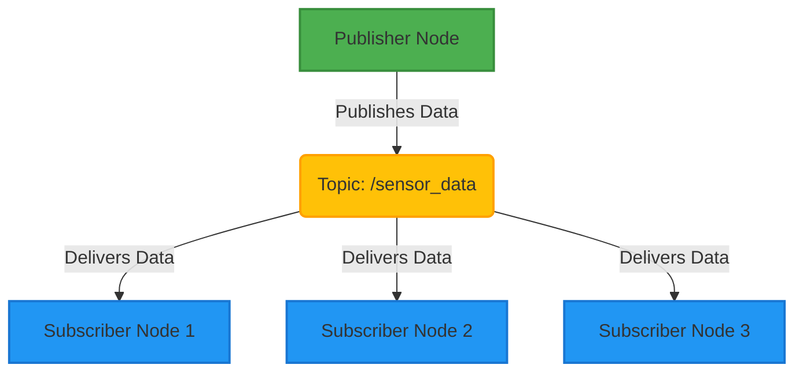

# ROS 2 Nodes and Topics: The Foundation of Robot Communication

Welcome to the heart of ROS 2 communication! In this chapter, we'll dive deep into two fundamental concepts: **Nodes** and **Topics**. These elements form the backbone of how different parts of your robot's software communicate and cooperate. Understanding them is crucial for building robust and scalable robotics applications.

## Introduction to ROS 2 Communication

In the previous chapters, we briefly touched upon the distributed and modular architecture of ROS 2. This design philosophy allows complex robot systems to be broken down into smaller, manageable, and independently executable components. These components can then communicate with each other, often across different processes, machines, or even network locations, to achieve the overall functionality of the robot.

At the core of this distributed communication model are **nodes**, which are the fundamental computational units, and **topics**, which act as named data streams enabling asynchronous, one-to-many communication between these nodes.

:::tip Key Takeaway
ROS 2's distributed architecture relies heavily on **nodes** for modular computation and **topics** for asynchronous data exchange, forming a powerful framework for complex robotic systems.
:::

## ROS 2 Nodes

A **ROS 2 Node** is essentially an executable program that performs a specific task within the ROS 2 ecosystem. Think of it as a single, focused application or process that is part of your robot's overall software system. For instance, you might have one node responsible for reading sensor data from a LiDAR, another for performing navigation calculations, and a third for controlling the robot's motors.

The power of nodes lies in their modularity. Each node can be developed, tested, and run independently, making it easier to manage complex software, debug issues, and reuse components across different projects.

### Node Lifecycle

A typical ROS 2 node follows a predictable lifecycle:

1.  **Initialization**: When a node starts, it initializes the `rclpy` (for Python) or `rclcpp` (for C++) client library, sets up its name, and declares any parameters, publishers, or subscribers it intends to use.
2.  **Execution**: This is the main phase where the node performs its primary function. It might continuously read sensor data, process information, publish messages, or wait for incoming messages.
3.  **Shutdown**: When the node finishes its task or receives a shutdown signal, it cleans up resources, unregisters from the ROS 2 graph, and properly terminates.

### Role in Modularizing Robot Software

Modularizing robot software with nodes offers several benefits:

*   **Reusability**: Individual nodes can be reused in different robot projects or configurations.
*   **Maintainability**: Focusing on smaller, independent codebases makes it easier to understand, modify, and debug specific functionalities.
*   **Fault Isolation**: If one node crashes, it doesn't necessarily bring down the entire robot system. Other nodes can continue operating, or a recovery mechanism can restart the failed node.
*   **Distribution**: Nodes can run on different processors, computers, or even embedded systems, allowing for distributed computing and efficient resource utilization.

### Simple Python Example of a Node

Here's a basic Python example of a ROS 2 node. This node simply initializes itself and then immediately shuts down.

```python title="minimal_node.py" showLineNumbers
[View on GitHub](https://github.com/yourusername/physical-ai-code-examples/tree/main/week-03-ros2-part1/01-minimal-node/minimal_node.py)
import rclpy
from rclpy.node import Node

class MinimalNode(Node):
    def __init__(self):
        super().__init__('minimal_node')
        self.get_logger().info('Minimal node has started.')

def main(args=None):
    rclpy.init(args=args) # Initialize the ROS 2 client library
    minimal_node = MinimalNode() # Create an instance of our node
    rclpy.spin_once(minimal_node) # Keep the node alive for a short period (or until shutdown)
    minimal_node.destroy_node() # Explicitly destroy the node
    rclpy.shutdown() # Shut down the ROS 2 client library

if __name__ == '__main__':
    main()
```

To run this node, you would save it as, for example, `minimal_node.py`, and then use `ros2 run <package_name> minimal_node`. You would see the log message "Minimal node has started." followed by the node shutting down.

## ROS 2 Topics and Publish-Subscribe Pattern

**ROS 2 Topics** are the primary mechanism for real-time, unidirectional, asynchronous data streaming in ROS 2. Imagine topics as named buses or channels through which messages flow. Any node interested in a particular type of data can **subscribe** to that topic, and any node producing that data can **publish** messages to it.

This communication model is known as the **publish-subscribe pattern**.

### How the Publish-Subscribe Pattern Works



A common pattern in ROS 2 communication, the publish-subscribe model enables nodes to share information without direct knowledge of each other.


1.  **Publisher**: A node that wants to send data creates a **publisher** for a specific topic. It then continuously or periodically publishes messages to this topic.
2.  **Subscriber**: A node that wants to receive data creates a **subscriber** for the same topic. It defines a **callback function** that will be automatically invoked every time a new message arrives on that topic.
3.  **Topic**: The topic acts as a named conduit. Publishers don't know which subscribers exist, and subscribers don't know which publishers exist. They only interact with the topic. ROS 2's underlying DDS (Data Distribution Service) implementation handles the discovery and delivery of messages.

### Advantages for Distributed Systems

The publish-subscribe pattern offers significant advantages for distributed robotic systems:

*   **Decoupling**: Publishers and subscribers are loosely coupled. They don't need to know about each other's existence, location, or implementation details. This makes the system more flexible and easier to modify.
*   **Asynchronous Communication**: Messages are sent and received asynchronously. Publishers don't wait for subscribers to receive messages, and subscribers process messages when they arrive without blocking publishers. This improves overall system responsiveness.
*   **Scalability**: Adding new publishers or subscribers to a topic is straightforward without affecting existing components. This allows the system to scale easily as more functionalities or sensors are added.
*   **Broadcasting**: A single message published to a topic can be received by multiple subscribers simultaneously, which is ideal for broadcasting sensor data or command signals.

:::tip Key Takeaway
Topics provide a powerful, asynchronous **publish-subscribe** mechanism for data flow, offering **decoupling, scalability, and flexibility** crucial for distributed ROS 2 applications.
:::

## Message Types

For nodes to communicate effectively through topics, they need a common understanding of the data being exchanged. This is where **Message Types** come into play. A message type defines the structure and data types of the information contained within a message.

ROS 2 provides a rich set of predefined message types, organized into packages. Some commonly used packages include:

*   `std_msgs`: Contains basic data types like `String`, `Int32`, `Float64`, etc.
*   `geometry_msgs`: Defines messages for common geometric primitives, such as `Point`, `Vector3`, `Quaternion`, `Pose`, `Twist` (linear and angular velocity), etc. These are fundamental for representing robot states and commands.
*   `sensor_msgs`: Includes messages for various sensor data, such as `Image`, `LaserScan`, `Imu`, `JointState`, etc.
*   `nav_msgs`: Provides messages for navigation-related data, such as `Odometry` and `Path`.

### Inspecting Message Types

You can inspect the structure of any ROS 2 message type using the `ros2 interface show` command. For example, to see the structure of a `Twist` message:

```bash
ros2 interface show geometry_msgs/msg/Twist
```

Output will look something like this:

```
geometry_msgs/Vector3 linear
  float64 x
  float64 y
  float64 z
geometry_msgs/Vector3 angular
  float64 x
  float64 y
  float64 z
```

This output shows that a `Twist` message is composed of two `geometry_msgs/Vector3` fields: `linear` and `angular`, each having `x`, `y`, and `z` float64 components. This structured approach ensures that publishers and subscribers interpret data consistently.

## Quality of Service (QoS) Policies for Topics

ROS 2 leverages DDS (Data Distribution Service) for its underlying communication, which provides a highly configurable communication layer. **Quality of Service (QoS) policies** allow you to define the behavior and characteristics of data transmission for topics, enabling you to tailor communication to specific application requirements (e.g., high reliability for critical commands, low latency for sensor data).

QoS policies are set independently for publishers and subscribers, and for successful communication, their policies must be compatible.

Here are some key QoS policies relevant to topics:

### Reliability

This policy governs whether messages are guaranteed to arrive at subscribers.

*   **`Reliable`**: Ensures that every message published will eventually be delivered to all compatible subscribers, even if it requires retransmissions. This is crucial for critical data like robot commands or state updates where losing a message could be dangerous.
*   **`Best Effort`**: Does not guarantee delivery. Messages might be dropped if the network is congested or if the subscriber is not ready to receive them. This is often used for high-frequency, non-critical data like raw sensor readings, where occasional loss is acceptable to prioritize low latency.

### Durability

This policy determines whether messages published before a subscriber connects are received by that subscriber.

*   **`Transient Local`**: The publisher will retain a history of messages and send them to new subscribers upon connection. This is useful for "latched" topics where you want new subscribers to immediately get the last known state (e.g., a robot's current pose or a map).
*   **`Volatile`**: Only messages published *after* a subscriber connects will be received. This is the default and is suitable for most real-time streaming data where older messages are no longer relevant.

### History

This policy defines how messages are stored by the publisher (for `Transient Local` durability) or how many messages are buffered by the subscriber.

*   **`Keep Last`**: Only the N most recent messages are kept in history (where N is specified by the `Depth` policy). Older messages are discarded.
*   **`Keep All`**: All messages are kept in history, up to resource limits. This is generally only used with `Reliable` QoS and specific `Depth` settings to ensure no messages are lost.

### Depth

This policy is used in conjunction with `Keep Last` history. It specifies the maximum number of messages to keep in history. For example, if `History` is `Keep Last` and `Depth` is 10, the publisher will only store the last 10 messages, and new subscribers using `Transient Local` durability would receive those 10 messages.

### How QoS Affects Data Delivery and System Robustness

Choosing appropriate QoS policies is vital for optimizing your ROS 2 application:

*   **Reliability vs. Latency**: `Reliable` QoS adds overhead for retransmissions and acknowledgments, potentially increasing latency but guaranteeing delivery. `Best Effort` offers lower latency but at the risk of message loss.
*   **State vs. Stream**: `Transient Local` durability is excellent for broadcasting initial states, while `Volatile` is suitable for continuous data streams.
*   **Resource Usage**: `Keep All` history can consume significant memory if not managed with a sensible `Depth`.

Always consider the criticality of the data, the frequency of publication, and the network conditions when configuring QoS policies.

:::tip Key Takeaway
QoS policies (`Reliability`, `Durability`, `History`, `Depth`) are crucial for fine-tuning topic communication. They allow you to balance between **guaranteed delivery, latency, and resource usage** based on your application's needs.
:::

## Implementing a Minimal ROS 2 Publisher (Python)

Let's build a simple ROS 2 publisher node in Python that continuously publishes "Hello ROS 2 from Python!" messages to a topic.

### Step-by-Step Tutorial

1.  **Project Setup**:
    Ensure you have a ROS 2 workspace set up. Inside your package (e.g., `my_py_pkg`), create a new Python file, say `minimal_publisher.py`, in the `my_py_pkg/my_py_pkg` directory.

2.  **Import necessary libraries**:
    We need `rclpy` for ROS 2 Python client library functionality and `std_msgs.msg.String` for our message type.

3.  **Create a Node class**:
    Define a class that inherits from `rclpy.node.Node`. In its constructor, initialize the superclass with a unique node name.

4.  **Create a Publisher**:
    Inside the node's constructor, create a publisher using `self.create_publisher()`. It takes three arguments:
    *   The message type (`String`).
    *   The topic name (`'topic'`).
    *   The QoS profile depth (e.g., `10`).

5.  **Set up a timer for periodic publishing**:
    Use `self.create_timer()` to set up a callback that will be called at a fixed rate. This callback will be responsible for creating and publishing messages.

6.  **Implement the timer callback**:
    In the callback function, create an instance of the message type (`String()`), assign data to its `data` field, and then publish it using `self.publisher.publish()`. Log the published message for verification.

7.  **Main function**:
    In the `main` function:
    *   Initialize `rclpy`.
    *   Create an instance of your publisher node.
    *   Use `rclpy.spin()` to keep the node running until it's manually shut down (e.g., Ctrl+C). This allows the timer callback to execute.
    *   Upon shutdown, explicitly destroy the node and call `rclpy.shutdown()`.

### Complete Python Code for Minimal Publisher

```python title="minimal_publisher.py" showLineNumbers
[View on GitHub](https://github.com/yourusername/physical-ai-code-examples/tree/main/week-03-ros2-part1/02-minimal-publisher/minimal_publisher.py)
import rclpy
from rclpy.node import Node
from std_msgs.msg import String

class MinimalPublisher(Node):
    def __init__(self):
        super().__init__('minimal_publisher')
        # Create a publisher for String messages on the 'topic' topic with a QoS depth of 10
        self.publisher_ = self.create_publisher(String, 'topic', 10)
        self.i = 0
        # Create a timer that calls the timer_callback function every 0.5 seconds
        self.timer = self.create_timer(0.5, self.timer_callback)
        self.get_logger().info('Minimal Publisher Node has started.')

    def timer_callback(self):
        msg = String()
        msg.data = 'Hello ROS 2 from Python! %d' % self.i
        self.publisher_.publish(msg)
        self.get_logger().info(f'Publishing: "{msg.data}"')
        self.i += 1

def main(args=None):
    rclpy.init(args=args) # Initialize the ROS 2 client library
    minimal_publisher = MinimalPublisher() # Create an instance of the MinimalPublisher node

    # Keep the node running until it is explicitly shut down (e.g., Ctrl+C)
    # This allows the timer callback to continuously publish messages
    rclpy.spin(minimal_publisher)

    # Clean up resources when the node is shut down
    minimal_publisher.destroy_node()
    rclpy.shutdown()

if __name__ == '__main__':
    main()
```

To make this executable, remember to add an entry point in your `setup.py` file within the `entry_points` dictionary under `console_scripts`:

```python title="setup.py"
# setup.py
# ...
entry_points={
    'console_scripts': [
        'minimal_publisher = my_py_pkg.minimal_publisher:main',
        # ... other nodes
    ],
},
# ...
```

After modifying `setup.py` and running `colcon build`, you can execute your publisher:

```bash
ros2 run my_py_pkg minimal_publisher
```

You should see messages being published to the console every 0.5 seconds.

## Implementing a Minimal ROS 2 Subscriber (Python)

Now, let's create a subscriber node that listens to the "topic" topic and prints any `String` messages it receives.

### Step-by-Step Tutorial

1.  **Project Setup**:
    Similar to the publisher, inside your package (e.g., `my_py_pkg`), create a new Python file, say `minimal_subscriber.py`, in the `my_py_pkg/my_py_pkg` directory.

2.  **Import necessary libraries**:
    Again, `rclpy` and `std_msgs.msg.String` are needed.

3.  **Create a Node class**:
    Define a class inheriting from `rclpy.node.Node` and initialize the superclass with a unique node name.

4.  **Create a Subscriber**:
    Inside the node's constructor, create a subscriber using `self.create_subscription()`. It takes three arguments:
    *   The message type (`String`).
    *   The topic name (`'topic'`).
    *   The callback function (`self.listener_callback`) that will process incoming messages.
    *   The QoS profile depth (e.g., `10`).

5.  **Implement the callback function**:
    Define the `listener_callback` method. This method will receive one argument, which is the incoming message object. Inside this function, you can access the message's data (e.g., `msg.data`) and perform actions like logging it.

6.  **Main function**:
    The `main` function structure is almost identical to the publisher's:
    *   Initialize `rclpy`.
    *   Create an instance of your subscriber node.
    *   Use `rclpy.spin()` to keep the node running. `rclpy.spin()` will block and wait for messages to arrive, invoking the callback function whenever a new message is received.
    *   Upon shutdown, destroy the node and call `rclpy.shutdown()`.

### Complete Python Code for Minimal Subscriber

[View on GitHub](https://github.com/yourusername/physical-ai-code-examples/tree/main/week-03-ros2-part1/03-minimal-subscriber/minimal_subscriber.py)
```python title="minimal_subscriber.py" showLineNumbers
import rclpy
from rclpy.node import Node
from std_msgs.msg import String

class MinimalSubscriber(Node):
    def __init__(self):
        super().__init__('minimal_subscriber')
        # Create a subscriber for String messages on the 'topic' topic with a QoS depth of 10
        # The listener_callback function will be called whenever a new message arrives
        self.subscription = self.create_subscription(
            String,
            'topic',
            self.listener_callback,
            10)
        self.subscription # prevent unused variable warning
        self.get_logger().info('Minimal Subscriber Node has started and is listening.')

    def listener_callback(self, msg):
        # This function is called every time a message is received
        self.get_logger().info(f'I heard: "{msg.data}"')

def main(args=None):
    rclpy.init(args=args) # Initialize the ROS 2 client library
    minimal_subscriber = MinimalSubscriber() # Create an instance of the MinimalSubscriber node

    # Keep the node running and listening for messages until it is explicitly shut down (e.g., Ctrl+C)
    # rclpy.spin() enters a loop that processes events, including incoming messages.
    rclpy.spin(minimal_subscriber)

    # Clean up resources when the node is shut down
    minimal_subscriber.destroy_node()
    rclpy.shutdown()

if __name__ == '__main__':
    main()
```

Again, update your `setup.py` for the new entry point:

```python title="setup.py"
# setup.py
# ...
entry_points={
    'console_scripts': [
        'minimal_publisher = my_py_pkg.minimal_publisher:main',
        'minimal_subscriber = my_py_pkg.minimal_subscriber:main',
        # ... other nodes
    ],
},
# ...
```

After rebuilding your package, you can run the subscriber in a separate terminal while your publisher is running:

```bash
ros2 run my_py_pkg minimal_subscriber
```

You should now see the subscriber printing the messages sent by the publisher! This demonstrates a complete, albeit minimal, ROS 2 publish-subscribe communication loop.

This concludes our deep dive into ROS 2 Nodes and Topics. You now have a solid understanding of these foundational concepts and how to implement basic publisher and subscriber nodes in Python. These building blocks are essential for developing any complex robotic application with ROS 2.
