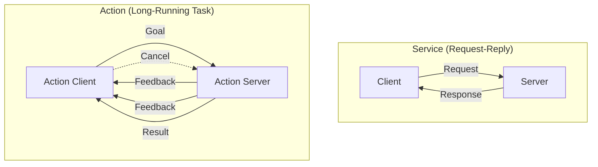
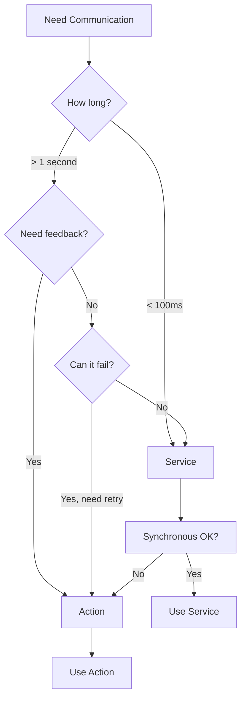

# Services and Actions in ROS 2

## Overview

While the publisher-subscriber pattern covered in Week 3 is perfect for continuous data streams, robotics applications often need different communication paradigms. Sometimes you need to request a specific computation and wait for a result (like asking "what's 2+2?"), or you need to execute a long-running task while monitoring its progress (like "navigate to the kitchen and tell me how it's going").

This chapter introduces two essential ROS 2 communication patterns:

- **Services**: Synchronous request-reply pattern for quick computations
- **Actions**: Asynchronous pattern for long-running tasks with feedback and cancellation

By the end of this chapter, you'll understand when to use each pattern and how to implement both service and action servers and clients in Python.

## Key Concepts

### Services: Request-Reply Pattern

Services implement a synchronous request-reply pattern. A client sends a request to a server and waits for a response. Think of it like calling a function on another node.

**When to Use Services:**
- Quick computations that complete in milliseconds
- Database queries or lookups
- Configuration changes
- State queries ("what is your current mode?")
- Triggering specific behaviors

**Service Characteristics:**
- **Synchronous**: Client blocks waiting for response
- **One-to-one**: Only one server per service name
- **Not continuous**: One request, one response, then done
- **No feedback**: You wait, then get the final result

### Actions: Long-Running Tasks with Feedback

Actions are designed for tasks that take time to complete and where you want progress updates along the way. They're asynchronous and support feedback and cancellation.

**When to Use Actions:**
- Navigation to a goal position
- Picking up an object (multi-step manipulation)
- Training a model
- Executing a multi-step mission
- Any task that takes >1 second and has meaningful progress

**Action Characteristics:**
- **Asynchronous**: Client doesn't block, can do other work
- **Feedback**: Server sends progress updates during execution
- **Cancellable**: Client can cancel the action mid-execution
- **Result**: Final outcome when task completes or is cancelled

### Communication Pattern Comparison



## Service Implementation

### Defining a Service

Services use `.srv` files to define the request and response structure. Here's the classic `AddTwoInts` service:

```text
# AddTwoInts.srv
int64 a
int64 b
---
int64 sum
```

The `---` separator divides the request (above) from the response (below).

ROS 2 provides many built-in services. For this example, we'll use `example_interfaces/srv/AddTwoInts`.

### Creating a Service Server

A service server listens for requests and executes a callback to generate responses.

```python
#!/usr/bin/env python3
"""
Service Server Example: Add Two Integers

This node provides a service that adds two integers and returns the sum.
Demonstrates synchronous request-reply pattern.
"""

import rclpy
from rclpy.node import Node
from example_interfaces.srv import AddTwoInts


class AddTwoIntsServer(Node):
    """
    Service server that adds two integers.

    Provides the /add_two_ints service for quick arithmetic operations.
    """

    def __init__(self):
        super().__init__('add_two_ints_server')

        # Create service
        # Parameters: service_type, service_name, callback
        self.srv = self.create_service(
            AddTwoInts,
            'add_two_ints',
            self.add_two_ints_callback
        )

        self.get_logger().info('Add Two Ints Server is ready.')

    def add_two_ints_callback(self, request, response):
        """
        Service callback: receives request, returns response.

        Args:
            request: AddTwoInts.Request with fields a and b
            response: AddTwoInts.Response with field sum

        Returns:
            response: Populated response object
        """
        # Perform computation
        response.sum = request.a + request.b

        # Log the operation
        self.get_logger().info(
            f'Incoming request: a={request.a}, b={request.b}'
        )
        self.get_logger().info(f'Sending back response: sum={response.sum}')

        return response


def main(args=None):
    rclpy.init(args=args)

    server = AddTwoIntsServer()

    try:
        rclpy.spin(server)
    except KeyboardInterrupt:
        pass
    finally:
        server.destroy_node()
        rclpy.shutdown()


if __name__ == '__main__':
    main()
```

### Creating a Service Client

A service client sends requests to a service server and waits for responses.

```python
#!/usr/bin/env python3
"""
Service Client Example: Call Add Two Ints Service

This node calls the /add_two_ints service with command-line arguments.
Demonstrates how to make synchronous service calls.
"""

import sys
import rclpy
from rclpy.node import Node
from example_interfaces.srv import AddTwoInts


class AddTwoIntsClient(Node):
    """
    Service client that requests addition of two integers.
    """

    def __init__(self):
        super().__init__('add_two_ints_client')

        # Create client
        # Parameters: service_type, service_name
        self.client = self.create_client(AddTwoInts, 'add_two_ints')

        # Wait for service to be available
        while not self.client.wait_for_service(timeout_sec=1.0):
            self.get_logger().info('Service not available, waiting...')

    def send_request(self, a, b):
        """
        Send a service request and wait for the response.

        Args:
            a (int): First integer
            b (int): Second integer

        Returns:
            int: Sum of a and b
        """
        # Create request object
        request = AddTwoInts.Request()
        request.a = a
        request.b = b

        # Call service (synchronous)
        # call() blocks until response is received
        future = self.client.call_async(request)
        rclpy.spin_until_future_complete(self, future)

        if future.result() is not None:
            response = future.result()
            self.get_logger().info(
                f'Result: {a} + {b} = {response.sum}'
            )
            return response.sum
        else:
            self.get_logger().error('Service call failed')
            return None


def main(args=None):
    rclpy.init(args=args)

    # Parse command-line arguments
    if len(sys.argv) != 3:
        print("Usage: ros2 run <package> service_client <a> <b>")
        return

    try:
        a = int(sys.argv[1])
        b = int(sys.argv[2])
    except ValueError:
        print("Arguments must be integers")
        return

    client = AddTwoIntsClient()
    client.send_request(a, b)

    client.destroy_node()
    rclpy.shutdown()


if __name__ == '__main__':
    main()
```

**Running the Service:**

```bash
# Terminal 1: Start server
ros2 run my_package service_server

# Terminal 2: Call service
ros2 run my_package service_client 5 7
# Output: Result: 5 + 7 = 12

# Or use ros2 service command
ros2 service call /add_two_ints example_interfaces/srv/AddTwoInts "{a: 10, b: 20}"
```

## Action Implementation

### Understanding Action Structure

Actions have three parts:
1. **Goal**: What you want to achieve (e.g., "navigate to point X")
2. **Feedback**: Progress updates (e.g., "50% complete, current position Y")
3. **Result**: Final outcome (e.g., "arrived successfully" or "failed: obstacle")

### Creating an Action Server

Let's create a Fibonacci action that computes the sequence and provides feedback.

```python
#!/usr/bin/env python3
"""
Action Server Example: Fibonacci Sequence

This node provides an action that computes Fibonacci numbers up to order n.
Sends feedback after computing each number in the sequence.
Demonstrates long-running task with progress updates and cancellation.
"""

import time
import rclpy
from rclpy.action import ActionServer, CancelResponse, GoalResponse
from rclpy.node import Node
from rclpy.executors import MultiThreadedExecutor
from example_interfaces.action import Fibonacci


class FibonacciActionServer(Node):
    """
    Action server that computes Fibonacci sequence with feedback.
    """

    def __init__(self):
        super().__init__('fibonacci_action_server')

        # Create action server
        self._action_server = ActionServer(
            self,
            Fibonacci,
            'fibonacci',
            execute_callback=self.execute_callback,
            goal_callback=self.goal_callback,
            cancel_callback=self.cancel_callback
        )

        self.get_logger().info('Fibonacci Action Server is ready.')

    def goal_callback(self, goal_request):
        """
        Called when a new goal is received.
        Decide whether to accept or reject the goal.

        Args:
            goal_request: Fibonacci.Goal

        Returns:
            GoalResponse.ACCEPT or GoalResponse.REJECT
        """
        # Validate goal (reject negative orders)
        if goal_request.order < 0:
            self.get_logger().warn(
                f'Rejecting goal with negative order: {goal_request.order}'
            )
            return GoalResponse.REJECT

        self.get_logger().info(
            f'Accepting goal with order: {goal_request.order}'
        )
        return GoalResponse.ACCEPT

    def cancel_callback(self, goal_handle):
        """
        Called when client requests cancellation.

        Args:
            goal_handle: Handle to the goal being cancelled

        Returns:
            CancelResponse.ACCEPT or CancelResponse.REJECT
        """
        self.get_logger().info('Received cancel request')
        return CancelResponse.ACCEPT

    async def execute_callback(self, goal_handle):
        """
        Execute the goal: compute Fibonacci sequence.
        Send feedback after each number.

        Args:
            goal_handle: Handle to the executing goal

        Returns:
            Fibonacci.Result
        """
        self.get_logger().info('Executing goal...')

        # Initialize feedback message
        feedback_msg = Fibonacci.Feedback()
        feedback_msg.sequence = [0, 1]

        # Compute Fibonacci sequence
        for i in range(1, goal_handle.request.order):
            # Check if goal was cancelled
            if goal_handle.is_cancel_requested:
                goal_handle.canceled()
                self.get_logger().info('Goal canceled')
                return Fibonacci.Result()

            # Compute next Fibonacci number
            next_num = feedback_msg.sequence[i] + feedback_msg.sequence[i-1]
            feedback_msg.sequence.append(next_num)

            # Send feedback to client
            goal_handle.publish_feedback(feedback_msg)
            self.get_logger().info(
                f'Publishing feedback: {feedback_msg.sequence}'
            )

            # Simulate computation time
            time.sleep(0.5)

        # Mark goal as succeeded
        goal_handle.succeed()

        # Create and return result
        result = Fibonacci.Result()
        result.sequence = feedback_msg.sequence

        self.get_logger().info(f'Returning result: {result.sequence}')
        return result


def main(args=None):
    rclpy.init(args=args)

    server = FibonacciActionServer()

    # Use MultiThreadedExecutor to handle callbacks concurrently
    executor = MultiThreadedExecutor()
    executor.add_node(server)

    try:
        executor.spin()
    except KeyboardInterrupt:
        pass
    finally:
        server.destroy_node()
        rclpy.shutdown()


if __name__ == '__main__':
    main()
```

### Creating an Action Client

An action client sends goals, receives feedback, and handles results.

```python
#!/usr/bin/env python3
"""
Action Client Example: Call Fibonacci Action

This node sends a goal to the Fibonacci action server and
prints feedback as it arrives.
"""

import rclpy
from rclpy.action import ActionClient
from rclpy.node import Node
from example_interfaces.action import Fibonacci


class FibonacciActionClient(Node):
    """
    Action client that requests Fibonacci computation.
    """

    def __init__(self):
        super().__init__('fibonacci_action_client')

        # Create action client
        self._action_client = ActionClient(
            self,
            Fibonacci,
            'fibonacci'
        )

    def send_goal(self, order):
        """
        Send goal to action server.

        Args:
            order (int): Fibonacci order to compute
        """
        # Wait for action server
        self.get_logger().info('Waiting for action server...')
        self._action_client.wait_for_server()

        # Create goal message
        goal_msg = Fibonacci.Goal()
        goal_msg.order = order

        self.get_logger().info(f'Sending goal: order={order}')

        # Send goal (asynchronous)
        send_goal_future = self._action_client.send_goal_async(
            goal_msg,
            feedback_callback=self.feedback_callback
        )

        # Register callback for when goal is accepted/rejected
        send_goal_future.add_done_callback(self.goal_response_callback)

    def goal_response_callback(self, future):
        """
        Called when server responds to goal request.
        """
        goal_handle = future.result()

        if not goal_handle.accepted:
            self.get_logger().warn('Goal rejected')
            return

        self.get_logger().info('Goal accepted')

        # Register callback for result
        result_future = goal_handle.get_result_async()
        result_future.add_done_callback(self.get_result_callback)

    def feedback_callback(self, feedback_msg):
        """
        Called when server publishes feedback.

        Args:
            feedback_msg: Fibonacci.Feedback
        """
        feedback = feedback_msg.feedback
        self.get_logger().info(
            f'Received feedback: {feedback.sequence}'
        )

    def get_result_callback(self, future):
        """
        Called when action completes.
        """
        result = future.result().result
        status = future.result().status

        if status == 4:  # SUCCEEDED
            self.get_logger().info(
                f'Action succeeded! Final sequence: {result.sequence}'
            )
        else:
            self.get_logger().warn(f'Action failed with status: {status}')


def main(args=None):
    rclpy.init(args=args)

    client = FibonacciActionClient()
    client.send_goal(10)

    rclpy.spin(client)

    client.destroy_node()
    rclpy.shutdown()


if __name__ == '__main__':
    main()
```

**Running the Action:**

```bash
# Terminal 1: Start action server
ros2 run my_package action_server

# Terminal 2: Send goal
ros2 run my_package action_client

# Or use ros2 action command
ros2 action send_goal /fibonacci example_interfaces/action/Fibonacci "{order: 5}" --feedback
```

## Common Patterns

### Pattern 1: Service with Error Handling

Always handle service unavailability and timeouts gracefully:

```python
def call_service_with_timeout(self, a, b, timeout_sec=5.0):
    """Call service with timeout and error handling."""

    # Wait for service with timeout
    if not self.client.wait_for_service(timeout_sec=timeout_sec):
        self.get_logger().error(
            f'Service not available after waiting {timeout_sec} seconds'
        )
        return None

    request = AddTwoInts.Request()
    request.a = a
    request.b = b

    future = self.client.call_async(request)

    # Wait with timeout
    rclpy.spin_until_future_complete(self, future, timeout_sec=timeout_sec)

    if future.done():
        if future.result() is not None:
            return future.result().sum
        else:
            self.get_logger().error('Service call failed')
    else:
        self.get_logger().error('Service call timed out')

    return None
```

### Pattern 2: Action with Cancellation

Allow users to cancel long-running actions:

```python
def send_goal_with_cancel(self, order, cancel_after_sec=3.0):
    """Send goal and cancel after specified time."""

    goal_msg = Fibonacci.Goal()
    goal_msg.order = order

    send_goal_future = self._action_client.send_goal_async(goal_msg)
    rclpy.spin_until_future_complete(self, send_goal_future)

    goal_handle = send_goal_future.result()

    if not goal_handle.accepted:
        return

    # Wait, then cancel
    time.sleep(cancel_after_sec)

    self.get_logger().info('Canceling goal...')
    cancel_future = goal_handle.cancel_goal_async()
    rclpy.spin_until_future_complete(self, cancel_future)
```

### Pattern 3: Service vs Action Decision Tree



## Common Pitfalls

:::danger Blocking the Main Thread
**Problem**: Calling `call_async()` followed by `spin_until_future_complete()` blocks your node.

**Solution**: Use callbacks or run services in a separate thread/executor.

```python
# Bad: Blocks the node
future = self.client.call_async(request)
rclpy.spin_until_future_complete(self, future)

# Good: Non-blocking with callback
future = self.client.call_async(request)
future.add_done_callback(self.handle_response)
```
:::

:::danger Not Checking Service Availability
**Problem**: Calling a service that doesn't exist causes your node to hang.

**Solution**: Always use `wait_for_service()` with a timeout.

```python
# Always check before calling
if not self.client.wait_for_service(timeout_sec=5.0):
    self.get_logger().error('Service unavailable!')
    return
```
:::

:::danger Ignoring Action Cancellation
**Problem**: Action server doesn't check `is_cancel_requested`, wastes resources.

**Solution**: Check regularly in long-running loops.

```python
# Check in every iteration
for i in range(100):
    if goal_handle.is_cancel_requested:
        goal_handle.canceled()
        return Result()
    # ... do work
```
:::

:::danger Using Services for Long Tasks
**Problem**: Service calls timeout or block other operations.

**Solution**: Use actions for any task > 1 second.
:::

## Summary

In this chapter, you learned:

- **Services** provide synchronous request-reply communication for quick operations
- **Actions** enable asynchronous long-running tasks with feedback and cancellation
- Service servers respond to requests using callbacks that return responses
- Service clients wait for responses (blocking) or use async patterns
- Action servers accept goals, publish feedback, and return results
- Action clients send goals, monitor feedback, and can cancel tasks
- Choosing the right pattern depends on duration, need for feedback, and blocking tolerance

**Key Decision Criteria:**
- **< 100ms, one-shot**: Service
- **> 1 second or need feedback**: Action
- **Continuous stream**: Topic (from Week 3)

With services and actions in your toolkit alongside topics, you now have all three core ROS 2 communication patterns. In the next section, we'll build a complete publisher-subscriber system that integrates these concepts.

## Further Reading

- [ROS 2 Services Official Tutorial](https://docs.ros.org/en/humble/Tutorials/Beginner-CLI-Tools/Understanding-ROS2-Services/Understanding-ROS2-Services.html)
- [ROS 2 Actions Official Tutorial](https://docs.ros.org/en/humble/Tutorials/Beginner-CLI-Tools/Understanding-ROS2-Actions/Understanding-ROS2-Actions.html)
- [rclpy API: Services](https://docs.ros2.org/latest/api/rclpy/api/services.html)
- [rclpy API: Actions](https://docs.ros2.org/latest/api/rclpy/api/actions.html)
