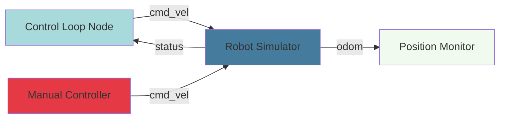

# Building a Complete Publisher-Subscriber System

## Overview

In Week 3, you learned the basics of publishers and subscribers in isolation. Real-world robotics applications combine multiple nodes working together, handling errors, coordinating timing, and managing state. This chapter guides you through building a complete system that simulates a robot controller with velocity commands, status monitoring, and a control loop.

You'll create three interconnected nodes:

1. **Velocity Publisher**: Sends movement commands to the robot
2. **Status Subscriber**: Monitors robot health and position
3. **Control Loop Node**: Combines both, implementing a simple feedback controller

This hands-on system demonstrates production-ready patterns you'll use in actual robot development.

## System Architecture

Our complete system simulates a mobile robot with these components:



**Topics:**
- `/cmd_vel` (geometry_msgs/Twist): Velocity commands
- `/status` (std_msgs/String): Robot status messages
- `/odom` (nav_msgs/Odometry): Position and velocity feedback

## Component 1: Velocity Publisher

Let's start with a node that publishes velocity commands to move the robot.

### Basic Velocity Publisher

```python
#!/usr/bin/env python3
"""
Velocity Publisher: Send movement commands to robot.

Publishes Twist messages on /cmd_vel topic to control robot velocity.
Demonstrates timer-based publishing with configurable rates.
"""

import rclpy
from rclpy.node import Node
from geometry_msgs.msg import Twist


class VelocityPublisher(Node):
    """
    Publishes velocity commands at regular intervals.

    This node sends Twist messages to control linear and angular velocity
    of a mobile robot.
    """

    def __init__(self):
        super().__init__('velocity_publisher')

        # Declare parameters with default values
        self.declare_parameter('linear_speed', 0.5)  # m/s
        self.declare_parameter('angular_speed', 0.0)  # rad/s
        self.declare_parameter('publish_rate', 10.0)  # Hz

        # Get parameter values
        self.linear_speed = self.get_parameter('linear_speed').value
        self.angular_speed = self.get_parameter('angular_speed').value
        publish_rate = self.get_parameter('publish_rate').value

        # Create publisher
        # QoS: queue size of 10 messages
        self.publisher = self.create_publisher(
            Twist,
            'cmd_vel',
            10
        )

        # Create timer for periodic publishing
        timer_period = 1.0 / publish_rate  # seconds
        self.timer = self.create_timer(timer_period, self.timer_callback)

        self.get_logger().info(
            f'Velocity Publisher started: linear={self.linear_speed} m/s, '
            f'angular={self.angular_speed} rad/s, rate={publish_rate} Hz'
        )

    def timer_callback(self):
        """
        Timer callback: publish velocity command.

        Called at the rate specified by publish_rate parameter.
        Creates and publishes a Twist message with current velocity values.
        """
        msg = Twist()

        # Set linear velocity (x-axis: forward/backward)
        msg.linear.x = self.linear_speed
        msg.linear.y = 0.0  # No lateral movement
        msg.linear.z = 0.0  # No vertical movement

        # Set angular velocity (z-axis: rotation)
        msg.angular.x = 0.0
        msg.angular.y = 0.0
        msg.angular.z = self.angular_speed

        # Publish message
        self.publisher.publish(msg)

        # Log every 10th message to avoid spam
        if hasattr(self, 'msg_count'):
            self.msg_count += 1
        else:
            self.msg_count = 0

        if self.msg_count % 10 == 0:
            self.get_logger().debug(
                f'Publishing: linear={msg.linear.x:.2f}, '
                f'angular={msg.angular.z:.2f}'
            )


def main(args=None):
    rclpy.init(args=args)

    velocity_publisher = VelocityPublisher()

    try:
        rclpy.spin(velocity_publisher)
    except KeyboardInterrupt:
        pass
    finally:
        # Send stop command before shutting down
        stop_msg = Twist()  # All zeros
        velocity_publisher.publisher.publish(stop_msg)
        velocity_publisher.get_logger().info('Stopping robot...')

        velocity_publisher.destroy_node()
        rclpy.shutdown()


if __name__ == '__main__':
    main()
```

**Running with Parameters:**

```bash
# Default parameters
ros2 run my_package velocity_publisher

# Custom parameters
ros2 run my_package velocity_publisher --ros-args \
  -p linear_speed:=1.0 \
  -p angular_speed:=0.5 \
  -p publish_rate:=20.0

# Move in a circle (forward + rotation)
ros2 run my_package velocity_publisher --ros-args \
  -p linear_speed:=0.3 \
  -p angular_speed:=0.5
```

## Component 2: Status Subscriber

Now create a node that subscribes to robot status updates.

### Status Monitor Subscriber

```python
#!/usr/bin/env python3
"""
Status Subscriber: Monitor robot health and state.

Subscribes to /status topic and processes status messages.
Demonstrates subscriber patterns with state tracking and alerts.
"""

import rclpy
from rclpy.node import Node
from std_msgs.msg import String
from datetime import datetime


class StatusSubscriber(Node):
    """
    Monitors robot status messages and tracks system health.

    Subscribes to status updates and maintains history of robot state.
    Alerts on critical status changes.
    """

    def __init__(self):
        super().__init__('status_subscriber')

        # Subscriber
        self.subscription = self.create_subscription(
            String,
            'status',
            self.status_callback,
            10
        )

        # State tracking
        self.last_status = None
        self.status_count = 0
        self.error_count = 0
        self.last_update_time = None

        # Health monitoring
        self.health_status = 'UNKNOWN'

        # Timer to check for message timeouts
        self.timeout_timer = self.create_timer(5.0, self.check_timeout)

        self.get_logger().info('Status Subscriber started')

    def status_callback(self, msg):
        """
        Process incoming status messages.

        Args:
            msg (std_msgs/String): Status message from robot
        """
        self.status_count += 1
        self.last_update_time = datetime.now()

        status_text = msg.data
        self.get_logger().info(f'Received status: {status_text}')

        # Parse status and update health
        self.update_health(status_text)

        # Detect status changes
        if status_text != self.last_status:
            self.get_logger().info(
                f'Status changed: {self.last_status} -> {status_text}'
            )
            self.last_status = status_text

        # Check for error conditions
        if 'ERROR' in status_text.upper() or 'FAULT' in status_text.upper():
            self.error_count += 1
            self.get_logger().error(
                f'⚠️  Error detected in status: {status_text}'
            )

    def update_health(self, status_text):
        """
        Update overall health status based on message content.

        Args:
            status_text (str): Status message content
        """
        status_upper = status_text.upper()

        if 'ERROR' in status_upper or 'FAULT' in status_upper:
            self.health_status = 'CRITICAL'
        elif 'WARNING' in status_upper:
            self.health_status = 'DEGRADED'
        elif 'OK' in status_upper or 'READY' in status_upper:
            self.health_status = 'HEALTHY'
        else:
            self.health_status = 'UNKNOWN'

        # Log health changes
        self.get_logger().debug(f'Health status: {self.health_status}')

    def check_timeout(self):
        """
        Check if we've stopped receiving status messages.

        Called periodically by timer. Alerts if no messages received recently.
        """
        if self.last_update_time is None:
            self.get_logger().warn('No status messages received yet')
            return

        time_since_update = (datetime.now() - self.last_update_time).total_seconds()

        if time_since_update > 10.0:
            self.get_logger().error(
                f'⚠️  Status messages timeout! Last update {time_since_update:.1f}s ago'
            )
            self.health_status = 'DISCONNECTED'

    def get_statistics(self):
        """
        Return monitoring statistics.

        Returns:
            dict: Statistics about received messages
        """
        return {
            'total_messages': self.status_count,
            'error_count': self.error_count,
            'health_status': self.health_status,
            'last_status': self.last_status
        }


def main(args=None):
    rclpy.init(args=args)

    subscriber = StatusSubscriber()

    try:
        rclpy.spin(subscriber)
    except KeyboardInterrupt:
        # Print final statistics
        stats = subscriber.get_statistics()
        subscriber.get_logger().info(
            f'Shutting down. Statistics: {stats}'
        )
    finally:
        subscriber.destroy_node()
        rclpy.shutdown()


if __name__ == '__main__':
    main()
```

## Component 3: Complete Control Loop

Now combine publishing and subscribing in a single node with a control loop.

### Feedback Control Node

```python
#!/usr/bin/env python3
"""
Control Loop: Integrated publisher-subscriber with feedback control.

Combines velocity publishing and status monitoring in a single node.
Implements a simple proportional controller for position tracking.
"""

import rclpy
from rclpy.node import Node
from geometry_msgs.msg import Twist
from nav_msgs.msg import Odometry
import math


class FeedbackController(Node):
    """
    Feedback controller that adjusts velocity based on position error.

    Subscribes to odometry, publishes velocity commands.
    Demonstrates integrated pub-sub with control logic.
    """

    def __init__(self):
        super().__init__('feedback_controller')

        # Parameters
        self.declare_parameter('target_x', 5.0)  # meters
        self.declare_parameter('target_y', 0.0)
        self.declare_parameter('kp_linear', 0.5)  # Proportional gain
        self.declare_parameter('kp_angular', 1.0)
        self.declare_parameter('goal_tolerance', 0.1)  # meters

        self.target_x = self.get_parameter('target_x').value
        self.target_y = self.get_parameter('target_y').value
        self.kp_linear = self.get_parameter('kp_linear').value
        self.kp_angular = self.get_parameter('kp_angular').value
        self.goal_tolerance = self.get_parameter('goal_tolerance').value

        # Publisher: velocity commands
        self.cmd_publisher = self.create_publisher(
            Twist,
            'cmd_vel',
            10
        )

        # Subscriber: odometry feedback
        self.odom_subscriber = self.create_subscription(
            Odometry,
            'odom',
            self.odom_callback,
            10
        )

        # State
        self.current_x = 0.0
        self.current_y = 0.0
        self.current_theta = 0.0
        self.goal_reached = False

        # Control loop timer (20 Hz)
        self.timer = self.create_timer(0.05, self.control_loop)

        self.get_logger().info(
            f'Controller started. Target: ({self.target_x}, {self.target_y})'
        )

    def odom_callback(self, msg):
        """
        Update current position from odometry.

        Args:
            msg (nav_msgs/Odometry): Odometry message with pose and twist
        """
        # Extract position
        self.current_x = msg.pose.pose.position.x
        self.current_y = msg.pose.pose.position.y

        # Extract orientation (quaternion -> yaw angle)
        orientation_q = msg.pose.pose.orientation
        self.current_theta = self.quaternion_to_yaw(
            orientation_q.x,
            orientation_q.y,
            orientation_q.z,
            orientation_q.w
        )

    def quaternion_to_yaw(self, x, y, z, w):
        """
        Convert quaternion to yaw angle.

        Args:
            x, y, z, w: Quaternion components

        Returns:
            float: Yaw angle in radians
        """
        # Yaw (z-axis rotation)
        siny_cosp = 2.0 * (w * z + x * y)
        cosy_cosp = 1.0 - 2.0 * (y * y + z * z)
        return math.atan2(siny_cosp, cosy_cosp)

    def control_loop(self):
        """
        Main control loop: compute and publish velocity commands.

        Implements proportional controller for position tracking.
        Called at 20 Hz by timer.
        """
        if self.goal_reached:
            return

        # Compute position error
        dx = self.target_x - self.current_x
        dy = self.target_y - self.current_y
        distance = math.sqrt(dx**2 + dy**2)

        # Check if goal reached
        if distance < self.goal_tolerance:
            self.stop_robot()
            self.goal_reached = True
            self.get_logger().info(
                f'🎯 Goal reached! Final position: ({self.current_x:.2f}, {self.current_y:.2f})'
            )
            return

        # Compute desired heading
        desired_theta = math.atan2(dy, dx)

        # Angular error (normalize to [-pi, pi])
        angle_error = desired_theta - self.current_theta
        angle_error = math.atan2(math.sin(angle_error), math.cos(angle_error))

        # Proportional control
        linear_velocity = self.kp_linear * distance
        angular_velocity = self.kp_angular * angle_error

        # Clamp velocities to safe limits
        linear_velocity = max(-0.5, min(0.5, linear_velocity))
        angular_velocity = max(-1.0, min(1.0, angular_velocity))

        # Publish command
        cmd = Twist()
        cmd.linear.x = linear_velocity
        cmd.angular.z = angular_velocity
        self.cmd_publisher.publish(cmd)

        # Log progress periodically
        if hasattr(self, 'loop_count'):
            self.loop_count += 1
        else:
            self.loop_count = 0

        if self.loop_count % 20 == 0:  # Every second at 20Hz
            self.get_logger().info(
                f'Position: ({self.current_x:.2f}, {self.current_y:.2f}), '
                f'Distance to goal: {distance:.2f}m, '
                f'Heading error: {math.degrees(angle_error):.1f}°'
            )

    def stop_robot(self):
        """Send zero velocity command to stop the robot."""
        stop_cmd = Twist()
        self.cmd_publisher.publish(stop_cmd)
        self.get_logger().info('Stopping robot')


def main(args=None):
    rclpy.init(args=args)

    controller = FeedbackController()

    try:
        rclpy.spin(controller)
    except KeyboardInterrupt:
        pass
    finally:
        controller.stop_robot()
        controller.destroy_node()
        rclpy.shutdown()


if __name__ == '__main__':
    main()
```

## Error Handling Patterns

Real-world systems need robust error handling. Here are essential patterns:

### Pattern 1: Message Timeout Detection

```python
class TimeoutAwareSubscriber(Node):
    """Subscriber with message timeout detection."""

    def __init__(self):
        super().__init__('timeout_subscriber')

        self.subscription = self.create_subscription(
            Odometry,
            'odom',
            self.callback,
            10
        )

        self.last_msg_time = self.get_clock().now()
        self.timeout_threshold = 1.0  # seconds

        # Check for timeouts periodically
        self.timer = self.create_timer(0.5, self.check_timeout)

    def callback(self, msg):
        self.last_msg_time = self.get_clock().now()
        # Process message...

    def check_timeout(self):
        """Alert if messages stop arriving."""
        elapsed = (self.get_clock().now() - self.last_msg_time).nanoseconds / 1e9

        if elapsed > self.timeout_threshold:
            self.get_logger().error(
                f'⚠️  Message timeout! No data for {elapsed:.1f}s'
            )
            # Take safe action (e.g., stop robot)
            self.handle_timeout()

    def handle_timeout(self):
        """Safe behavior when messages timeout."""
        # Stop robot, enter safe mode, etc.
        pass
```

### Pattern 2: Rate Limiting and Throttling

```python
class ThrottledPublisher(Node):
    """Publisher that enforces rate limits."""

    def __init__(self):
        super().__init__('throttled_publisher')

        self.publisher = self.create_publisher(Twist, 'cmd_vel', 10)

        self.max_rate = 10.0  # Hz
        self.min_interval = 1.0 / self.max_rate
        self.last_publish_time = self.get_clock().now()

    def publish_command(self, cmd):
        """
        Publish command only if enough time has passed.

        Args:
            cmd (Twist): Command to publish

        Returns:
            bool: True if published, False if rate-limited
        """
        now = self.get_clock().now()
        elapsed = (now - self.last_publish_time).nanoseconds / 1e9

        if elapsed < self.min_interval:
            self.get_logger().debug(
                f'Rate limited: {elapsed:.3f}s < {self.min_interval:.3f}s'
            )
            return False

        self.publisher.publish(cmd)
        self.last_publish_time = now
        return True
```

### Pattern 3: Safe Shutdown

```python
class SafeShutdownNode(Node):
    """Node with proper cleanup on shutdown."""

    def __init__(self):
        super().__init__('safe_node')

        self.cmd_publisher = self.create_publisher(Twist, 'cmd_vel', 10)

        # Register shutdown handler
        self.context.on_shutdown(self.shutdown_callback)

    def shutdown_callback(self):
        """
        Called when node is shutting down.
        Send safe commands before exit.
        """
        self.get_logger().info('Shutdown initiated - sending stop command')

        # Send stop command
        stop_cmd = Twist()
        self.cmd_publisher.publish(stop_cmd)

        # Wait briefly for message to send
        import time
        time.sleep(0.1)

        self.get_logger().info('Shutdown complete')
```

## System Integration Example

Let's create a complete system with a simulated robot:

```python
#!/usr/bin/env python3
"""
Complete System: Robot Simulator + Controller

Simulates a robot that responds to velocity commands and publishes status.
Demonstrates full pub-sub system integration.
"""

import rclpy
from rclpy.node import Node
from geometry_msgs.msg import Twist
from nav_msgs.msg import Odometry
from std_msgs.msg import String
import math


class RobotSimulator(Node):
    """
    Simulates a differential drive robot.

    Subscribes to cmd_vel, publishes odometry and status.
    """

    def __init__(self):
        super().__init__('robot_simulator')

        # Subscribers
        self.cmd_subscriber = self.create_subscription(
            Twist,
            'cmd_vel',
            self.cmd_callback,
            10
        )

        # Publishers
        self.odom_publisher = self.create_publisher(Odometry, 'odom', 10)
        self.status_publisher = self.create_publisher(String, 'status', 10)

        # Robot state
        self.x = 0.0
        self.y = 0.0
        self.theta = 0.0
        self.linear_vel = 0.0
        self.angular_vel = 0.0

        # Simulation parameters
        self.dt = 0.05  # 20 Hz update rate

        # Timers
        self.sim_timer = self.create_timer(self.dt, self.update_simulation)
        self.status_timer = self.create_timer(1.0, self.publish_status)

        self.get_logger().info('Robot Simulator started')

    def cmd_callback(self, msg):
        """Update commanded velocities."""
        self.linear_vel = msg.linear.x
        self.angular_vel = msg.angular.z

    def update_simulation(self):
        """
        Update robot pose based on velocity commands.
        Simple kinematic model for differential drive.
        """
        # Update heading
        self.theta += self.angular_vel * self.dt

        # Normalize theta to [-pi, pi]
        self.theta = math.atan2(math.sin(self.theta), math.cos(self.theta))

        # Update position
        self.x += self.linear_vel * math.cos(self.theta) * self.dt
        self.y += self.linear_vel * math.sin(self.theta) * self.dt

        # Publish odometry
        self.publish_odometry()

    def publish_odometry(self):
        """Publish current pose as odometry message."""
        odom = Odometry()
        odom.header.stamp = self.get_clock().now().to_msg()
        odom.header.frame_id = 'odom'
        odom.child_frame_id = 'base_link'

        # Position
        odom.pose.pose.position.x = self.x
        odom.pose.pose.position.y = self.y
        odom.pose.pose.position.z = 0.0

        # Orientation (yaw to quaternion)
        odom.pose.pose.orientation.z = math.sin(self.theta / 2.0)
        odom.pose.pose.orientation.w = math.cos(self.theta / 2.0)

        # Velocity
        odom.twist.twist.linear.x = self.linear_vel
        odom.twist.twist.angular.z = self.angular_vel

        self.odom_publisher.publish(odom)

    def publish_status(self):
        """Publish status message."""
        status = String()

        # Determine status based on state
        if abs(self.linear_vel) < 0.01 and abs(self.angular_vel) < 0.01:
            status.data = 'IDLE - Ready for commands'
        else:
            status.data = f'MOVING - Linear: {self.linear_vel:.2f} m/s, Angular: {self.angular_vel:.2f} rad/s'

        self.status_publisher.publish(status)


def main(args=None):
    rclpy.init(args=args)

    simulator = RobotSimulator()

    try:
        rclpy.spin(simulator)
    except KeyboardInterrupt:
        pass
    finally:
        simulator.destroy_node()
        rclpy.shutdown()


if __name__ == '__main__':
    main()
```

**Running the Complete System:**

```bash
# Terminal 1: Start simulator
ros2 run my_package robot_simulator

# Terminal 2: Start controller
ros2 run my_package feedback_controller --ros-args -p target_x:=5.0 -p target_y:=3.0

# Terminal 3: Monitor status
ros2 run my_package status_subscriber

# Terminal 4: Visualize topics
ros2 topic echo /odom
```

## Common Pitfalls

:::danger Race Conditions in Callbacks
**Problem**: Accessing shared state from multiple callbacks without synchronization.

**Solution**: Use ROS 2's single-threaded executor (default) or protect state with locks.

```python
# Safe: default single-threaded executor handles one callback at a time
# All callbacks run sequentially, no race conditions
```
:::

:::danger Publishing Before Subscribers Connect
**Problem**: Early messages lost because no subscribers exist yet.

**Solution**: Wait for subscribers or use latched topics.

```python
# Check subscriber count before critical messages
while self.publisher.get_subscription_count() < 1:
    self.get_logger().info('Waiting for subscribers...')
    time.sleep(0.5)

self.publisher.publish(critical_msg)
```
:::

:::danger Ignoring QoS Settings
**Problem**: Messages dropped or delayed due to mismatched QoS.

**Solution**: Match QoS profiles between publisher and subscriber.

```python
from rclpy.qos import QoSProfile, ReliabilityPolicy

# Reliable delivery for critical messages
qos = QoSProfile(depth=10, reliability=ReliabilityPolicy.RELIABLE)
self.publisher = self.create_publisher(Twist, 'cmd_vel', qos)
```
:::

:::danger Not Handling Missing Data
**Problem**: Controller crashes when odometry hasn't arrived yet.

**Solution**: Check data validity before using it.

```python
def control_loop(self):
    if not hasattr(self, 'current_x'):
        self.get_logger().warn('Waiting for odometry...')
        return  # Skip this iteration

    # Safe to use self.current_x
```
:::

## Summary

In this chapter, you built a complete publisher-subscriber system including:

- **Velocity Publisher**: Timer-based publishing with parameters
- **Status Subscriber**: Message monitoring with timeout detection
- **Feedback Controller**: Integrated pub-sub with control logic
- **Robot Simulator**: Complete system integration example

**Key Patterns Learned:**
- Timer-based periodic publishing
- State tracking in subscribers
- Timeout detection and alerts
- Proportional feedback control
- Safe shutdown procedures
- Error handling and validation

**Production-Ready Practices:**
- Parameter-based configuration
- Comprehensive logging
- Timeout and error detection
- Rate limiting
- Safe shutdown handling

You now have the foundation to build complex multi-node ROS 2 systems. Next, we'll explore custom message types to define your own data structures.

## Exercises

1. **Modify the controller** to track a circular path instead of a point
2. **Add obstacle avoidance** to the controller using simulated laser scan data
3. **Implement PID control** instead of proportional-only (add integral and derivative terms)
4. **Create a waypoint follower** that navigates through multiple target positions
5. **Add emergency stop** functionality that monitors a safety topic

## Further Reading

- [ROS 2 Writing a Simple Publisher and Subscriber](https://docs.ros.org/en/humble/Tutorials/Beginner-Client-Libraries/Writing-A-Simple-Py-Publisher-And-Subscriber.html)
- [geometry_msgs/Twist Documentation](https://docs.ros.org/en/humble/p/geometry_msgs/)
- [nav_msgs/Odometry Documentation](https://docs.ros.org/en/humble/p/nav_msgs/)
- [ROS 2 QoS Policies](https://docs.ros.org/en/humble/Concepts/About-Quality-of-Service-Settings.html)
