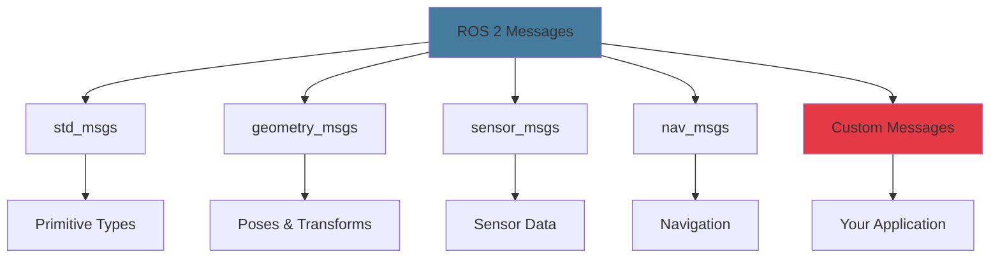

# Understanding ROS 2 Message Types

## Overview

Messages are the data structures that flow between nodes in ROS 2. Every topic has a message type that defines the structure of data being published and subscribed. While ROS 2 provides hundreds of standard message types for common robotics tasks, you'll often need to create custom messages for your specific application.

This chapter covers:

- **Standard message types** and when to use them
- **Common message packages** (std_msgs, geometry_msgs, sensor_msgs, nav_msgs)
- **Creating custom messages** step-by-step
- **Message composition** (nesting messages)
- **Best practices** for message design

By the end, you'll be able to choose appropriate standard messages and create well-designed custom messages for your robot applications.

## Standard Message Packages

ROS 2 organizes messages into packages by domain. Understanding these packages helps you find the right message type quickly.

### Message Type Hierarchy



### std_msgs: Primitive Types

The `std_msgs` package provides wrappers for basic data types. Use these for simple, single-value messages.

```python
from std_msgs.msg import (
    String,      # Single string value
    Int32,       # 32-bit integer
    Float64,     # 64-bit float
    Bool,        # Boolean
    Empty,       # No data (trigger/event)
    Header,      # Timestamp and frame_id
)

# Example: Publishing a simple string
from std_msgs.msg import String

msg = String()
msg.data = "Robot initialized successfully"
publisher.publish(msg)

# Example: Publishing a number
from std_msgs.msg import Float64

temperature = Float64()
temperature.data = 23.5  # Celsius
temp_publisher.publish(temperature)
```

**Common std_msgs Types:**

| Message Type | Use Case | Fields |
|-------------|----------|--------|
| `String` | Text messages, status | `data` (string) |
| `Int32`, `Int64` | Counters, IDs | `data` (int) |
| `Float32`, `Float64` | Sensor values | `data` (float) |
| `Bool` | Flags, states | `data` (bool) |
| `Empty` | Events, triggers | (none) |
| `Header` | Timestamps | `stamp`, `frame_id` |

:::tip When to Use std_msgs
Use `std_msgs` for:
- Quick prototyping and testing
- Simple status messages
- Single-value sensor readings

Avoid for production systems where self-documenting field names add clarity.
:::

### geometry_msgs: Poses and Transforms

The `geometry_msgs` package defines spatial data structures for position, orientation, and movement.

```python
from geometry_msgs.msg import (
    Point,           # 3D point (x, y, z)
    Pose,            # Position + Orientation
    PoseStamped,     # Pose with timestamp and frame
    Twist,           # Linear and angular velocity
    Transform,       # Translation + Rotation
    Quaternion,      # Orientation (4D)
)

# Example: Robot position
from geometry_msgs.msg import Point

position = Point()
position.x = 1.5  # meters
position.y = 2.3
position.z = 0.0

# Example: Velocity command
from geometry_msgs.msg import Twist

cmd_vel = Twist()
cmd_vel.linear.x = 0.5   # m/s forward
cmd_vel.linear.y = 0.0   # m/s left
cmd_vel.linear.z = 0.0   # m/s up
cmd_vel.angular.x = 0.0  # rad/s roll
cmd_vel.angular.y = 0.0  # rad/s pitch
cmd_vel.angular.z = 0.3  # rad/s yaw (turn left)
```

**Key geometry_msgs Types:**

| Message Type | Use Case | Key Fields |
|-------------|----------|------------|
| `Point` | 3D coordinates | `x`, `y`, `z` |
| `Quaternion` | Orientation (rotation) | `x`, `y`, `z`, `w` |
| `Pose` | Position + orientation | `position`, `orientation` |
| `PoseStamped` | Pose with timestamp | `header`, `pose` |
| `Twist` | Velocity (linear + angular) | `linear`, `angular` |
| `Transform` | Coordinate transformation | `translation`, `rotation` |

**Example: Complete Pose Message**

```python
from geometry_msgs.msg import PoseStamped

pose = PoseStamped()

# Header: timestamp and reference frame
pose.header.stamp = self.get_clock().now().to_msg()
pose.header.frame_id = 'map'

# Position
pose.pose.position.x = 3.0
pose.pose.position.y = 2.0
pose.pose.position.z = 0.0

# Orientation (quaternion for 45° rotation around z-axis)
pose.pose.orientation.x = 0.0
pose.pose.orientation.y = 0.0
pose.pose.orientation.z = 0.3826834  # sin(45°/2)
pose.pose.orientation.w = 0.9238795  # cos(45°/2)

pose_publisher.publish(pose)
```

### sensor_msgs: Sensor Data

The `sensor_msgs` package provides messages for common robot sensors.

```python
from sensor_msgs.msg import (
    Image,           # Camera image data
    LaserScan,       # 2D laser range data
    PointCloud2,     # 3D point cloud
    Imu,             # Inertial Measurement Unit
    JointState,      # Robot joint positions
    BatteryState,    # Battery information
)
```

**Example: Laser Scan Message**

```python
from sensor_msgs.msg import LaserScan
import math

scan = LaserScan()

# Header
scan.header.stamp = self.get_clock().now().to_msg()
scan.header.frame_id = 'laser_frame'

# Scan parameters
scan.angle_min = -math.pi / 2  # -90 degrees
scan.angle_max = math.pi / 2   # +90 degrees
scan.angle_increment = math.pi / 180  # 1 degree
scan.time_increment = 0.0
scan.scan_time = 0.1  # 10 Hz

scan.range_min = 0.1  # 10 cm minimum
scan.range_max = 10.0  # 10 m maximum

# Range data (distance measurements)
scan.ranges = [1.5, 1.6, 1.7, 1.8, ...]  # One per angle

laser_publisher.publish(scan)
```

### nav_msgs: Navigation Messages

The `nav_msgs` package contains messages for navigation and mapping.

```python
from nav_msgs.msg import (
    Odometry,        # Robot pose and velocity
    Path,            # Sequence of poses
    OccupancyGrid,   # 2D map representation
)

# Example: Odometry message
from nav_msgs.msg import Odometry

odom = Odometry()
odom.header.stamp = self.get_clock().now().to_msg()
odom.header.frame_id = 'odom'
odom.child_frame_id = 'base_link'

# Pose (position + orientation)
odom.pose.pose.position.x = 1.0
odom.pose.pose.position.y = 0.5
odom.pose.pose.orientation.w = 1.0  # No rotation

# Twist (velocity)
odom.twist.twist.linear.x = 0.3
odom.twist.twist.angular.z = 0.1

odom_publisher.publish(odom)
```

## Creating Custom Messages

When standard messages don't fit your needs, create custom messages. Custom messages make your data self-documenting and type-safe.

### Step 1: Create Message Definition File

Message files use the `.msg` extension and define fields with type and name.

**Example: `RobotStatus.msg`**

```text
# RobotStatus.msg
# Custom message for robot health and state

# Header with timestamp
std_msgs/Header header

# Robot identification
string robot_id
string robot_name

# Status information
string status_code        # "OK", "WARNING", "ERROR"
string status_message     # Detailed status description

# Health metrics
float32 battery_voltage   # Volts
float32 battery_percent   # 0-100
float32 temperature       # Celsius
float32 cpu_usage         # 0-100 percent

# Position (if available)
bool position_valid
geometry_msgs/Point position

# Operational flags
bool motors_enabled
bool emergency_stop
bool autonomous_mode
```

**Message Field Types:**

| Category | Types |
|----------|-------|
| Integers | `int8`, `int16`, `int32`, `int64`, `uint8`, `uint16`, `uint32`, `uint64` |
| Floats | `float32`, `float64` |
| Boolean | `bool` |
| String | `string` |
| Time | `builtin_interfaces/Time`, `builtin_interfaces/Duration` |
| Arrays | `type[]` (dynamic), `type[n]` (fixed size) |
| Other messages | `package_name/MessageType` |

### Step 2: Package Setup

Custom messages require a separate package or integration into your existing package.

**Directory Structure:**

```
my_robot_interfaces/
├── CMakeLists.txt
├── package.xml
└── msg/
    ├── RobotStatus.msg
    └── SensorData.msg
```

**package.xml:**

```xml
<?xml version="1.0"?>
<?xml-model href="http://download.ros.org/schema/package_format3.xsd" schematypens="http://www.w3.org/2001/XMLSchema"?>
<package format="3">
  <name>my_robot_interfaces</name>
  <version>0.1.0</version>
  <description>Custom messages for my robot</description>
  <maintainer email="you@example.com">Your Name</maintainer>
  <license>MIT</license>

  <buildtool_depend>ament_cmake</buildtool_depend>

  <!-- Message generation dependencies -->
  <build_depend>rosidl_default_generators</build_depend>
  <exec_depend>rosidl_default_runtime</exec_depend>
  <member_of_group>rosidl_interface_packages</member_of_group>

  <!-- Message dependencies -->
  <depend>std_msgs</depend>
  <depend>geometry_msgs</depend>

</package>
```

**CMakeLists.txt:**

```cmake
cmake_minimum_required(VERSION 3.8)
project(my_robot_interfaces)

# Find dependencies
find_package(ament_cmake REQUIRED)
find_package(rosidl_default_generators REQUIRED)
find_package(std_msgs REQUIRED)
find_package(geometry_msgs REQUIRED)

# Declare messages
rosidl_generate_interfaces(${PROJECT_NAME}
  "msg/RobotStatus.msg"
  "msg/SensorData.msg"
  DEPENDENCIES std_msgs geometry_msgs
)

ament_package()
```

### Step 3: Build the Package

```bash
# From workspace root
cd ~/ros2_ws

# Build the interfaces package
colcon build --packages-select my_robot_interfaces

# Source the workspace
source install/setup.bash

# Verify message is available
ros2 interface show my_robot_interfaces/msg/RobotStatus
```

### Step 4: Use Custom Message in Code

```python
#!/usr/bin/env python3
"""
Example: Publishing custom RobotStatus messages
"""

import rclpy
from rclpy.node import Node
from my_robot_interfaces.msg import RobotStatus
from geometry_msgs.msg import Point


class RobotStatusPublisher(Node):
    """
    Publishes custom RobotStatus messages at 1 Hz.
    """

    def __init__(self):
        super().__init__('robot_status_publisher')

        # Create publisher for custom message
        self.publisher = self.create_publisher(
            RobotStatus,
            'robot_status',
            10
        )

        # Timer for periodic publishing
        self.timer = self.create_timer(1.0, self.publish_status)

        self.get_logger().info('Robot Status Publisher started')

    def publish_status(self):
        """Create and publish RobotStatus message."""

        msg = RobotStatus()

        # Header
        msg.header.stamp = self.get_clock().now().to_msg()
        msg.header.frame_id = 'base_link'

        # Robot identification
        msg.robot_id = 'robot_001'
        msg.robot_name = 'Explorer'

        # Status
        msg.status_code = 'OK'
        msg.status_message = 'All systems operational'

        # Health metrics (simulated)
        msg.battery_voltage = 12.4
        msg.battery_percent = 85.0
        msg.temperature = 42.3
        msg.cpu_usage = 35.2

        # Position
        msg.position_valid = True
        msg.position.x = 1.5
        msg.position.y = 2.3
        msg.position.z = 0.0

        # Flags
        msg.motors_enabled = True
        msg.emergency_stop = False
        msg.autonomous_mode = True

        # Publish
        self.publisher.publish(msg)

        self.get_logger().info(
            f'Published status: {msg.status_code}, '
            f'Battery: {msg.battery_percent:.1f}%'
        )


def main(args=None):
    rclpy.init(args=args)
    publisher = RobotStatusPublisher()

    try:
        rclpy.spin(publisher)
    except KeyboardInterrupt:
        pass
    finally:
        publisher.destroy_node()
        rclpy.shutdown()


if __name__ == '__main__':
    main()
```

## Advanced Message Patterns

### Arrays in Messages

Messages can contain dynamic or fixed-size arrays:

```text
# SensorArray.msg

# Dynamic array (variable length)
float32[] sensor_readings

# Fixed-size array (always 10 elements)
float32[10] calibration_values

# Array of other messages
geometry_msgs/Point[] waypoints
```

**Using arrays in code:**

```python
from my_robot_interfaces.msg import SensorArray
from geometry_msgs.msg import Point

msg = SensorArray()

# Dynamic array - can be any size
msg.sensor_readings = [1.2, 3.4, 5.6, 7.8]

# Fixed array - must be exactly 10 elements
msg.calibration_values = [0.0] * 10

# Array of messages
waypoint1 = Point(x=1.0, y=2.0, z=0.0)
waypoint2 = Point(x=3.0, y=4.0, z=0.0)
msg.waypoints = [waypoint1, waypoint2]
```

### Constants in Messages

Define constants for status codes, modes, etc.:

```text
# RobotMode.msg

# Status constants
uint8 MODE_IDLE = 0
uint8 MODE_MANUAL = 1
uint8 MODE_AUTONOMOUS = 2
uint8 MODE_EMERGENCY = 3

# Current mode
uint8 mode

# Description
string mode_description
```

**Using constants:**

```python
from my_robot_interfaces.msg import RobotMode

msg = RobotMode()
msg.mode = RobotMode.MODE_AUTONOMOUS
msg.mode_description = "Autonomous navigation active"

# Check mode
if msg.mode == RobotMode.MODE_EMERGENCY:
    handle_emergency()
```

### Nested Messages

Compose complex messages from simpler ones:

```text
# CompleteRobotState.msg

# Header
std_msgs/Header header

# Status information
my_robot_interfaces/RobotStatus status

# Current pose
geometry_msgs/PoseStamped pose

# Current velocity
geometry_msgs/Twist velocity

# Sensor data
sensor_msgs/LaserScan laser_scan
sensor_msgs/Imu imu_data

# Mission state
string current_mission
float32 mission_progress  # 0-100
```

## Message Design Best Practices

### Guideline 1: Always Include Header for Timestamped Data

```text
# Good: Include header for temporal data
std_msgs/Header header
float32 temperature

# Bad: No timestamp for time-series data
float32 temperature
```

### Guideline 2: Use Descriptive Field Names

```text
# Good: Clear field names with units
float32 battery_voltage_volts
float32 distance_to_goal_meters
float32 cpu_temperature_celsius

# Bad: Ambiguous names
float32 battery
float32 distance
float32 temp
```

### Guideline 3: Document with Comments

```text
# RobotCommand.msg
# Command message for robot control

# Header with timestamp
std_msgs/Header header

# Target linear velocity in meters per second
# Range: -2.0 to 2.0
float32 linear_velocity

# Target angular velocity in radians per second
# Range: -1.0 to 1.0
# Positive: counter-clockwise
float32 angular_velocity

# Command timeout in seconds
# Robot stops if no command received within this time
float32 timeout
```

### Guideline 4: Group Related Fields

```text
# Good: Organized structure
# Battery information
float32 battery_voltage
float32 battery_current
float32 battery_percent

# Motor information
bool motors_enabled
float32 motor_temperature

# Bad: Flat unorganized list
float32 battery_voltage
bool motors_enabled
float32 battery_current
float32 motor_temperature
float32 battery_percent
```

### Guideline 5: Prefer Standard Messages When Possible

```text
# Good: Reuse standard messages
geometry_msgs/Point target_position
geometry_msgs/Twist current_velocity

# Bad: Reinvent the wheel
float32 target_x
float32 target_y
float32 target_z
float32 velocity_linear_x
float32 velocity_angular_z
```

## Common Pitfalls

:::danger Forgetting to Rebuild After Message Changes
**Problem**: Modified `.msg` file but code still uses old definition.

**Solution**: Always rebuild after changing messages:

```bash
colcon build --packages-select my_robot_interfaces
source install/setup.bash
```
:::

:::danger Missing Message Dependencies
**Problem**: Build fails with "message not found" errors.

**Solution**: Declare dependencies in `package.xml` and `CMakeLists.txt`:

```xml
<depend>std_msgs</depend>
<depend>geometry_msgs</depend>
```
:::

:::danger Using Wrong Message Type
**Problem**: Publisher and subscriber use different message types for same topic.

**Solution**: Check message type compatibility:

```bash
# See what type a topic is using
ros2 topic info /robot_status

# See if your message matches
ros2 interface show my_robot_interfaces/msg/RobotStatus
```
:::

:::danger Oversized Messages
**Problem**: Messages too large cause network congestion.

**Solution**:
- Split large data into separate topics
- Use compression for image/point cloud data
- Consider if all fields are necessary
:::

## Summary

In this chapter, you learned:

- **Standard message packages**: std_msgs, geometry_msgs, sensor_msgs, nav_msgs
- **Message field types**: primitives, arrays, nested messages, constants
- **Creating custom messages**: .msg files, package setup, building
- **Using custom messages**: Import, populate, publish/subscribe
- **Best practices**: Headers, naming, documentation, reusing standards

**Key Takeaways:**

- Use standard messages when they fit your needs
- Create custom messages for domain-specific data
- Always include headers for timestamped data
- Document your messages thoroughly
- Rebuild after changing message definitions

With custom messages, you can create type-safe, self-documenting data structures tailored to your robot's needs. Next, we'll explore launch files to orchestrate multiple nodes.

## Exercises

1. **Create a custom message** for a temperature sensor with multiple readings
2. **Design a message hierarchy** for a complete drone state (battery, GPS, IMU, status)
3. **Convert existing code** using multiple topics to a single custom message
4. **Implement versioning** by creating RobotStatusV2 with additional fields
5. **Create constants-based** control message with predefined command modes

## Further Reading

- [ROS 2 Creating Custom Messages](https://docs.ros.org/en/humble/Tutorials/Beginner-Client-Libraries/Custom-ROS2-Interfaces.html)
- [ROS 2 Interface Definition](https://docs.ros.org/en/humble/Concepts/About-ROS-Interfaces.html)
- [Common ROS 2 Interfaces](https://github.com/ros2/common_interfaces)
- [Message Design Guidelines](https://wiki.ros.org/msg#Message_Description_Specification)
