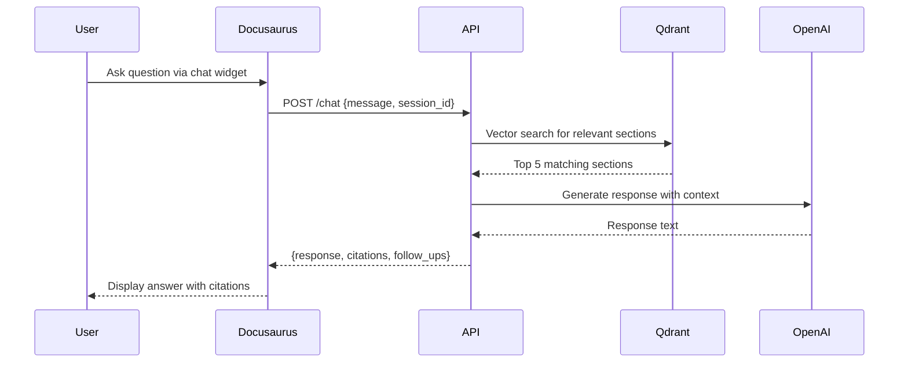

# API Contracts

This directory contains API specifications for future phases of the Physical AI Textbook project.

## Overview

The contracts define the interface between the Docusaurus frontend (Phase 1) and the RAG-powered chatbot backend (Phase 2+).

## Files

### chatbot-api.yaml

OpenAPI 3.1 specification for the chatbot REST API.

**Key Endpoints**:
- `POST /chat`: Send question, receive answer with citations
- `POST /chat/stream`: Stream chatbot response (SSE)
- `GET /chat/sessions/{session_id}`: Retrieve conversation history
- `GET /content/search`: Semantic search across textbook
- `GET /content/sections/{section_id}`: Retrieve specific section
- `GET /content/related`: Find related sections

**Authentication**: None in Phase 1/2, added in Phase 3

**Rate Limiting**: 10 requests/minute per IP (Phase 2)

## Usage

### View in Swagger UI

```bash
# Install Swagger UI Express (for local development)
npm install -g swagger-ui-express

# Or use online viewer
# https://editor.swagger.io/
# Upload chatbot-api.yaml
```

### Generate Client Code

```bash
# Generate TypeScript client for frontend
npx @openapitools/openapi-generator-cli generate \
  -i contracts/chatbot-api.yaml \
  -g typescript-fetch \
  -o ../frontend/src/api/generated

# Generate Python server stubs for backend
openapi-generator-cli generate \
  -i contracts/chatbot-api.yaml \
  -g python-fastapi \
  -o ../backend/src/api/generated
```

### Validate Contract

```bash
# Install validator
npm install -g @apidevtools/swagger-cli

# Validate OpenAPI spec
swagger-cli validate contracts/chatbot-api.yaml
```

## Phase Roadmap

### Phase 1: Static Textbook (Current)
- Docusaurus site with 3 chapters
- No backend, no API
- Contracts serve as planning documentation

### Phase 2: RAG Chatbot Integration
- Implement backend API per chatbot-api.yaml
- FastAPI + OpenAI + Qdrant vector DB
- Embed chatbot widget in Docusaurus pages
- Real-time Q&A with textbook citations

### Phase 3: Authentication & Personalization
- Add API key authentication
- User profiles and progress tracking
- Personalized content recommendations
- Session persistence across devices

### Phase 4: Advanced Features
- Urdu translation endpoints
- Multi-language chat support
- Advanced analytics
- Custom learning paths

## Design Principles

### 1. RESTful Design
- Resource-oriented URLs
- Standard HTTP methods (GET, POST, DELETE)
- Idempotent operations where appropriate

### 2. Performance Optimization
- Streaming for long responses (SSE)
- Pagination for search results
- Caching headers for content endpoints

### 3. Error Handling
- Standard HTTP status codes
- Structured error responses with codes and messages
- Rate limiting with retry-after headers

### 4. Semantic Search
- Vector embeddings for content sections
- Relevance scoring (0.0-1.0)
- Context-aware retrieval

### 5. Citation Quality
- All chatbot responses include source citations
- Relevance scores help users evaluate sources
- Direct links to textbook sections

## Example Integration

### React Component (Frontend)

```typescript
import { ChatAPI } from './api/generated';

const api = new ChatAPI({ basePath: 'https://api.physical-ai-textbook.com/v1' });

async function askQuestion(message: string, sessionId: string) {
  try {
    const response = await api.sendChatMessage({
      message,
      session_id: sessionId,
      context: {
        current_section: getCurrentSection(),
      },
    });

    return {
      answer: response.response,
      citations: response.citations,
      followUps: response.suggested_follow_ups,
    };
  } catch (error) {
    console.error('Chat API error:', error);
    throw error;
  }
}
```

### FastAPI Backend

```python
from fastapi import FastAPI, HTTPException
from app.schemas import ChatRequest, ChatResponse
from app.services.rag import RAGService

app = FastAPI()
rag_service = RAGService()

@app.post("/v1/chat", response_model=ChatResponse)
async def send_chat_message(request: ChatRequest):
    try:
        # Retrieve relevant sections via vector search
        relevant_sections = await rag_service.search_sections(
            query=request.message,
            limit=5
        )

        # Generate response with OpenAI
        response = await rag_service.generate_response(
            message=request.message,
            context_sections=relevant_sections,
            session_id=request.session_id
        )

        return response
    except Exception as e:
        raise HTTPException(status_code=500, detail=str(e))
```

## Data Flow



## Testing

### Contract Testing

```bash
# Install Dredd (API contract testing)
npm install -g dredd

# Test actual API against contract
dredd contracts/chatbot-api.yaml https://api.physical-ai-textbook.com
```

### Mock Server

```bash
# Generate mock server from OpenAPI spec
npx @stoplight/prism-cli mock contracts/chatbot-api.yaml

# Mock server runs on http://localhost:4010
# Use for frontend development before backend is ready
```

## Versioning

API versions follow semantic versioning:
- **v1.0.0**: Initial RAG chatbot (Phase 2)
- **v1.1.0**: Add authentication (Phase 3)
- **v1.2.0**: Add Urdu translation (Phase 4)
- **v2.0.0**: Breaking changes (if needed)

Version specified in URL path: `/v1/chat`

## Contributing

When modifying API contracts:

1. Update OpenAPI spec (chatbot-api.yaml)
2. Validate spec: `swagger-cli validate contracts/chatbot-api.yaml`
3. Regenerate client/server code if needed
4. Update this README with changes
5. Document breaking changes in CHANGELOG.md

## References

- [OpenAPI 3.1 Specification](https://spec.openapis.org/oas/v3.1.0)
- [FastAPI OpenAPI Support](https://fastapi.tiangolo.com/tutorial/metadata/)
- [Docusaurus API Integration](https://docusaurus.io/docs/advanced/client)
- [Qdrant Vector Search](https://qdrant.tech/documentation/)
