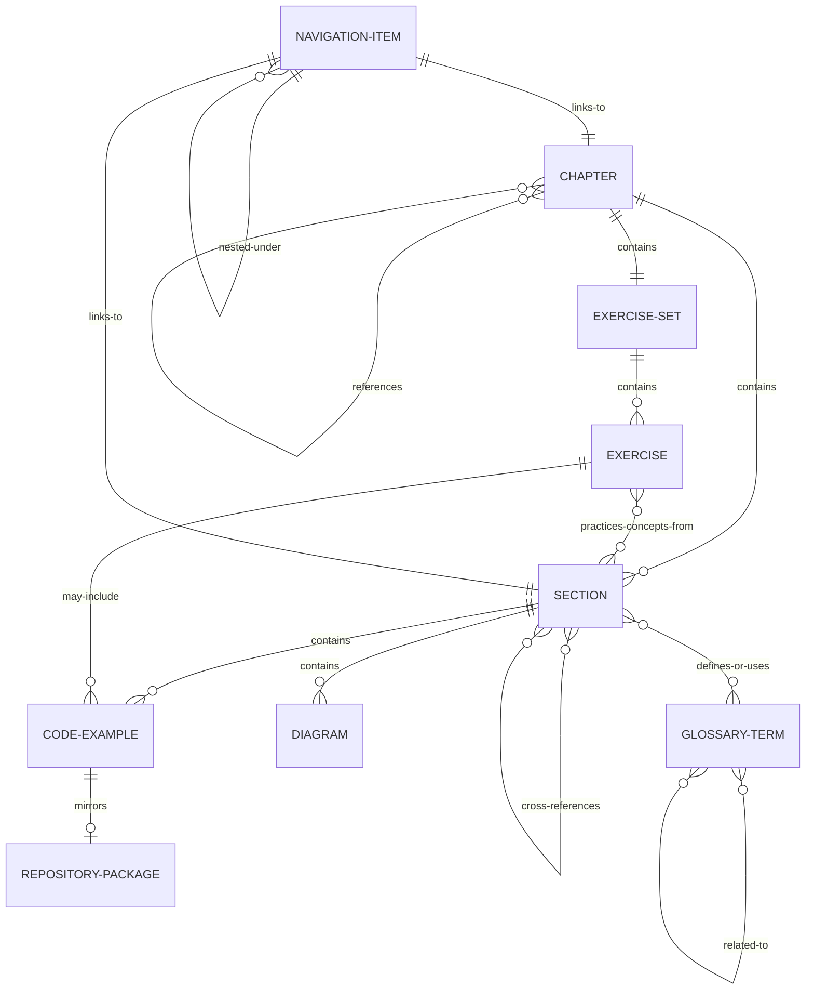

# Data Model: Docusaurus Robotics Textbook

**Feature**: 002-docusaurus-robotics-textbook
**Date**: 2025-11-30
**Purpose**: Define content entities, relationships, and validation rules

## Overview

This data model defines the structure of educational content entities for the Physical AI & Humanoid Robotics textbook. Since this is a static site, entities are represented as markdown files with YAML frontmatter rather than database schemas.

## Entity Definitions

### 1. Chapter

Represents a major learning module covering 1-2 weeks of curriculum.

**File Location**: `docs/week-XX-chapter-name/`

**Structure**:
```yaml
# category.json (defines chapter in sidebar)
{
  "label": "Week 1-2: Introduction to Physical AI",
  "position": 1,
  "description": "Foundations of embodied intelligence and sensor systems",
  "collapsed": false,
  "collapsible": true,
  "className": "chapter-category",
  "link": {
    "type": "doc",
    "id": "week-01-02-intro-physical-ai/index"
  }
}

# index.md (chapter overview page)
---
title: "Introduction to Physical AI"
description: "Explore the fundamental differences between physical and digital AI, understanding embodied intelligence and sensor systems"
keywords: [physical ai, embodied intelligence, robotics, sensors, actuators]
sidebar_position: 0
sidebar_label: "Overview"
---
```

**Fields**:
- `label` (string, required): Display name in sidebar (max 50 chars)
- `position` (integer, required): Ordering in sidebar (1-13)
- `description` (string, required): Brief chapter summary (max 200 chars)
- `collapsed` (boolean, default: false): Initial sidebar state
- `link.id` (string, required): Path to index.md (chapter overview)

**Content Requirements** (in index.md):
- Learning Objectives (3-5 bullet points, measurable with Bloom's taxonomy verbs)
- Prerequisites (list of prior knowledge required)
- Chapter Outline (links to all sections)
- Estimated Time (total reading + exercises time)
- Key Takeaways (summary box)

**Validation Rules**:
- Must contain 4-6 section files (01-*.md through 04-06-*.md)
- Must include exercises.md file
- Position must be unique across all chapters
- Label must not contain special characters beyond hyphens and colons

**Relationships**:
- Contains: 4-6 Sections (one-to-many)
- Contains: 1 Exercise Set (one-to-one)
- Contains: 1 Glossary (embedded in index.md)
- References: 0-many other Chapters (via cross-references)

---

### 2. Section

Represents a focused topic within a chapter, rendered as a separate navigable page.

**File Location**: `docs/week-XX-chapter-name/0X-section-slug.md`

**Frontmatter Structure**:
```yaml
---
title: "ROS 2 Architecture and Core Concepts"
sidebar_label: "ROS 2 Architecture"
sidebar_position: 1
description: "Understanding the layered architecture of ROS 2, from DDS middleware to client libraries"
keywords: [ros2, architecture, dds, middleware, rclpy, rclcpp]
reading_time: 10
difficulty: intermediate
prerequisites: [basic-linux, python-fundamentals]
---
```

**Fields**:
- `title` (string, required): Full section title for page header
- `sidebar_label` (string, required): Shortened label for sidebar (max 30 chars)
- `sidebar_position` (integer, required): Order within chapter (1-6)
- `description` (string, required): SEO and preview description
- `keywords` (array of strings, required): 5-8 relevant terms for search
- `reading_time` (integer, optional): Estimated minutes to read
- `difficulty` (enum, optional): beginner | intermediate | advanced
- `prerequisites` (array of strings, optional): Required prior knowledge slugs

**Content Structure**:
```markdown
# Section Title

## Overview
[2-3 sentence summary - optimized for RAG retrieval]

## Key Concepts
[Definitions and explanations with subheadings]

### Subsection 1
[Content with inline diagrams and examples]

### Subsection 2
[Content]

## Practical Example
[Code block with explanation]

## Common Pitfalls
:::warning
- Pitfall 1: [description and how to avoid]
- Pitfall 2: [description]
:::

## Summary
[Key takeaways in bullet points]

## Further Reading
- [Internal cross-reference to related section]
- [External link to ROS 2 documentation]
```

**Validation Rules**:
- Title must be unique within chapter
- Reading time: 8-12 minutes target (1500-2500 words)
- Must include at least 1 heading level 2 (##)
- Maximum heading depth: 4 levels (####)
- Keywords: minimum 5, maximum 8
- Code blocks: minimum 1 if difficulty is intermediate/advanced

**Relationships**:
- Belongs to: 1 Chapter (many-to-one)
- Contains: 1-5 Code Examples (one-to-many)
- Contains: 0-3 Diagrams (one-to-many)
- References: 0-many Cross-References (many-to-many)

---

### 3. Code Example

Runnable code snippet demonstrating a concept, embedded within section content.

**Markdown Structure**:
```markdown
```python title="simple_publisher.py" showLineNumbers
#!/usr/bin/env python3
import rclpy
from rclpy.node import Node
from std_msgs.msg import String

class SimplePublisher(Node):
    def __init__(self):
        super().__init__('simple_publisher')
        self.publisher_ = self.create_publisher(String, 'topic_name', 10)
        self.timer = self.create_timer(1.0, self.timer_callback)

    def timer_callback(self):
        msg = String()
        msg.data = 'Hello ROS 2!'
        self.publisher_.publish(msg)
        self.get_logger().info(f'Publishing: "{msg.data}"')

def main(args=None):
    rclpy.init(args=args)
    node = SimplePublisher()
    rclpy.spin(node)
    node.destroy_node()
    rclpy.shutdown()

if __name__ == '__main__':
    main()
\`\`\`

**Context**: This publisher node sends a message every second.
[View complete package](https://github.com/username/physical-ai-code-examples/tree/main/week-03-ros2-part1/01-simple-publisher)
with package.xml, setup.py, and installation instructions.
```

**Attributes**:
- `language` (string, required): python | cpp | bash | yaml | xml
- `title` (string, required): Filename or descriptive title
- `showLineNumbers` (boolean, default: true): Display line numbers
- `highlight` (string, optional): Comma-separated line numbers to emphasize (e.g., "5-7,12")

**Metadata** (in surrounding markdown):
- Description paragraph (before or after code block)
- Link to companion repository with complete runnable version
- Expected output (if command-line example)
- Common errors and troubleshooting (if complex)

**Validation Rules**:
- All Python code must include docstrings for classes and functions
- All code must be tested in ROS 2 environment before publication
- Title must include file extension
- Length: 10-50 lines (longer examples link to repository)
- Must include comments explaining non-obvious logic

**Repository Mirror**:
Each code example has a complete, tested version in the companion repository:
```text
physical-ai-code-examples/
└── week-03-ros2-part1/
    └── 01-simple-publisher/
        ├── simple_publisher.py    (full version)
        ├── package.xml
        ├── setup.py
        ├── README.md              (setup instructions)
        └── test_simple_publisher.py
```

**Relationships**:
- Belongs to: 1 Section (many-to-one)
- References: 0-1 Repository Package (one-to-one)

---

### 4. Exercise

Hands-on activity for students to practice concepts from the chapter.

**File Location**: `docs/week-XX-chapter-name/exercises.md`

**Frontmatter Structure**:
```yaml
---
title: "Exercises: Introduction to Physical AI"
sidebar_label: "Exercises"
sidebar_position: 99
description: "Hands-on exercises to reinforce Physical AI concepts"
keywords: [exercises, practice, hands-on, physical ai]
---
```

**Content Structure**:
```markdown
# Exercises: Chapter Name

## Exercise 1: Basic Concept Application
**Difficulty**: Beginner
**Estimated Time**: 15 minutes
**Learning Objective**: Demonstrate understanding of [specific concept]

### Instructions
1. Step-by-step instructions
2. Specific deliverable expected
3. Validation criteria

### Expected Outcome
[Clear description of what success looks like]

### Hints
<details>
<summary>Click for hint 1</summary>
[Helpful guidance without giving away answer]
</details>

<details>
<summary>Click for hint 2</summary>
[Additional guidance]
</details>

### Solution
<details>
<summary>View Solution</summary>

```python
# Complete solution code with explanatory comments
```

**Explanation**: [Why this solution works and key concepts demonstrated]
</details>

---

## Exercise 2: Intermediate Challenge
[Similar structure]

---

## Challenge Exercise (Optional)
**Difficulty**: Advanced
**Estimated Time**: 30-45 minutes
[More complex problem requiring synthesis of chapter concepts]
```

**Exercise Attributes**:
- `difficulty` (enum, required): Beginner | Intermediate | Advanced
- `estimated_time` (integer, required): Minutes to complete
- `learning_objective` (string, required): Specific skill demonstrated
- `tools_required` (array of strings, optional): ROS 2, Python, specific packages
- `deliverable` (string, required): What student produces

**Validation Rules**:
- Minimum 3 exercises per chapter (at least 1 beginner, 1 intermediate)
- Maximum 6 exercises per chapter
- Each exercise must have clear success criteria
- Solutions must be tested before publication
- Hints must provide guidance without revealing full solution

**Relationships**:
- Belongs to: 1 Chapter (many-to-one)
- References: 1-many Sections (concepts being practiced)
- May include: 0-many Code Examples

---

### 5. Diagram

Visual representation of architecture, flow, or concepts using Mermaid.js.

**Markdown Structure**:
```markdown
```mermaid
graph TD
    A[ROS 2 Application] --> B[rclpy Client Library]
    B --> C[rmw - ROS Middleware Interface]
    C --> D[DDS Implementation]
    D --> E[Network Layer]

    style A fill:#0ea5e9
    style D fill:#38bdf8
\`\`\`

**Figure 1**: ROS 2 layered architecture showing the stack from application layer to network communication.
```

**Diagram Types**:
- `graph TD` / `graph LR`: Flowcharts and architecture diagrams
- `sequenceDiagram`: Message flow and interaction patterns
- `classDiagram`: Object relationships
- `stateDiagram`: State machines
- `gantt`: Timelines (less common in this textbook)

**Attributes** (in surrounding markdown):
- Caption (required): "**Figure X**: Description"
- Alternative text (required): Detailed text description for accessibility
- Reference in body text (required): "...as shown in Figure 1..."

**Styling**:
```mermaid
%%{init: {'theme':'base', 'themeVariables': { 'primaryColor':'#0ea5e9', 'primaryTextColor':'#fff', 'primaryBorderColor':'#0284c7', 'lineColor':'#64748b', 'secondaryColor':'#38bdf8', 'tertiaryColor':'#e0f2fe'}}}%%
```

**Validation Rules**:
- Every diagram must have a caption with figure number
- Every diagram must have text alternative (for accessibility)
- Maximum complexity: 15 nodes/elements per diagram
- Must be referenced in surrounding text
- Color scheme must use robotics theme colors

**Fallback for Complex Visuals**:
When Mermaid is insufficient (e.g., robot physical structure):
```markdown
:::note Future Illustration: Humanoid Upper Body Sensors
**Visual Description for Designer**:
- Main subject: Humanoid robot upper torso, front 3/4 view
- Key components to highlight:
  - LiDAR sensor (blue): Mounted at chest center, 30cm from ground
  - Stereo cameras (green): Eye-level position, 8cm separation
  - IMU (red): Internal torso placement, indicated with dotted outline
- Callout lines with labels pointing to each component
- Style: Clean technical illustration, robotics blue color scheme (#0ea5e9)
- Dimensions: 800x600px, SVG format preferred

**Text Alternative**: The humanoid robot's perception system integrates three sensor types in the upper body. A LiDAR sensor mounted at chest center provides 360-degree distance measurements. Stereo cameras positioned at eye level with 8cm separation enable depth perception and object recognition. An IMU located in the torso tracks orientation and acceleration for balance control.
:::
```

**Relationships**:
- Belongs to: 1 Section (many-to-one)
- Illustrates: 1-many Concepts (one-to-many)

---

### 6. Cross-Reference

Link between related concepts across different sections or chapters.

**Markdown Structure**:
```markdown
For more details on ROS 2 topics, see [Understanding Topics and Messages](../week-03-ros2-part1/02-nodes-topics.md#topics).

:::tip Related Concept
This builds on the **embodied intelligence** principles discussed in
[Week 1: Foundations](../week-01-02-intro-physical-ai/02-embodied-intelligence.md).
:::
```

**Types of Cross-References**:

1. **Internal Link** (same chapter):
   ```markdown
   See [ROS 2 Architecture](#ros-2-architecture) above.
   ```

2. **Chapter Link** (different chapter):
   ```markdown
   Review [Physical AI Foundations](../week-01-02-intro-physical-ai/01-foundations.md).
   ```

3. **Section Anchor Link** (specific heading):
   ```markdown
   Learn more about [DDS middleware](../week-03-ros2-part1/01-ros2-architecture.md#dds-layer).
   ```

4. **Contextual Callout**:
   ```markdown
   :::tip Prerequisites
   Before proceeding, ensure you understand
   [Python decorators](../week-03-ros2-part1/03-first-python-node.md#decorators)
   and [class inheritance](../week-03-ros2-part1/03-first-python-node.md#node-class).
   :::
   ```

**Validation Rules**:
- All internal links must resolve (no broken links)
- Link text should be descriptive (avoid "click here")
- Maximum forward references: 3 (prefer linking backward to build on prior knowledge)
- Must use relative paths (for portability)

**Relationships**:
- Source: 1 Section (many-to-one)
- Target: 1 Section (many-to-one)
- Type: prerequisite | related-concept | deep-dive | example

---

### 7. Glossary Term

Definition of domain-specific terminology.

**File Location**: `docs/resources/glossary.md`

**Structure**:
```markdown
# Glossary

## A

### Actuator
A mechanical device that converts energy into motion. In robotics, actuators are motors, servos, or pneumatic cylinders that enable robot movement.

**Example**: A servo motor acting as an actuator controls the angle of a robot's elbow joint.

**Related Terms**: [Sensor](#sensor), [Degree of Freedom](#degree-of-freedom-dof)

**See Also**: [Sensor Systems](../week-01-02-intro-physical-ai/03-sensor-systems.md)

---

### Action (ROS 2)
A long-running task in ROS 2 with feedback and ability to cancel. Actions use three topics: goal, feedback, and result.

**Example**: A navigation action that moves a robot to a target position, providing progress updates.

**Related Terms**: [Service](#service-ros-2), [Topic](#topic-ros-2)

**See Also**: [Services and Actions](../week-04-ros2-part2/01-services-actions.md)
```

**Term Attributes**:
- Term name (h3 heading)
- Definition (1-2 sentences, concise and accurate)
- Example (optional but recommended): Concrete instance
- Related Terms: Links to other glossary entries
- See Also: Links to sections with detailed explanation

**Validation Rules**:
- Alphabetically organized
- No circular definitions (A defined using B, B defined using A)
- Plain language definitions (avoid using jargon in definitions)
- Each term linked from at least one section (no orphaned terms)

**In-Content Usage**:
```markdown
An **actuator** is a device that converts energy into motion (see [Glossary: Actuator](../resources/glossary.md#actuator)).
```

**Relationships**:
- Referenced by: 0-many Sections (many-to-many)
- Related to: 0-many other Terms (many-to-many)

---

### 8. Navigation Item

Entry in sidebar menu representing the hierarchical content structure.

**Generated from**: category.json + file frontmatter

**Sidebar Configuration** (sidebars.ts):
```typescript
import type {SidebarsConfig} from '@docusaurus/plugin-content-docs';

const sidebars: SidebarsConfig = {
  tutorialSidebar: [
    'intro',
    {
      type: 'category',
      label: 'Week 1-2: Introduction to Physical AI',
      collapsed: false,
      items: [
        'week-01-02-intro-physical-ai/index',
        'week-01-02-intro-physical-ai/01-foundations',
        'week-01-02-intro-physical-ai/02-embodied-intelligence',
        'week-01-02-intro-physical-ai/03-sensor-systems',
        'week-01-02-intro-physical-ai/04-physical-vs-digital-ai',
        'week-01-02-intro-physical-ai/exercises',
      ],
    },
    {
      type: 'category',
      label: 'Week 3: ROS 2 Part 1',
      collapsed: false,
      items: [
        'week-03-ros2-part1/index',
        'week-03-ros2-part1/01-ros2-architecture',
        'week-03-ros2-part1/02-nodes-topics',
        'week-03-ros2-part1/03-first-python-node',
        'week-03-ros2-part1/04-publisher-subscriber',
        'week-03-ros2-part1/exercises',
      ],
    },
    {
      type: 'category',
      label: 'Week 4: ROS 2 Part 2',
      collapsed: false,
      items: [
        'week-04-ros2-part2/index',
        'week-04-ros2-part2/01-services-actions',
        'week-04-ros2-part2/02-simple-pub-sub',
        'week-04-ros2-part2/03-message-types',
        'week-04-ros2-part2/04-launch-files',
        'week-04-ros2-part2/exercises',
      ],
    },
    {
      type: 'category',
      label: 'Resources',
      collapsed: true,
      items: [
        'resources/glossary',
        'resources/setup-guide',
      ],
    },
  ],
};

export default sidebars;
```

**Validation Rules**:
- Maximum nesting depth: 3 levels (tutorial > chapter > section)
- Each item must reference an existing markdown file
- Labels must be concise (max 40 chars for readability)
- Position numbers must create logical learning sequence

---

### 9. Theme Preference

User's color scheme selection, persisted in browser local storage.

**Storage**:
```javascript
// Automatically handled by Docusaurus
localStorage.setItem('theme', 'dark'); // or 'light'
```

**Values**:
- `light`: Light mode (default for first visit)
- `dark`: Dark mode
- Auto-detected from system preference if not explicitly set

**Implementation**:
```typescript
// docusaurus.config.ts
colorMode: {
  defaultMode: 'dark',
  disableSwitch: false,
  respectPrefersColorScheme: true,
}
```

**State Persistence**:
- Stored in: `localStorage.theme`
- Persists across: Sessions, browser restarts
- Cleared when: User clears browsing data
- Fallback: System preference or default mode

---

## Entity Relationship Diagram



## Validation Schema

### Chapter Validation
```yaml
required_files:
  - category.json
  - index.md
  - exercises.md
  - "0[1-6]-*.md" (4-6 section files)

category_json_schema:
  label: string (max 50 chars)
  position: integer (1-13)
  description: string (max 200 chars)
  link.id: string (must match index.md path)

index_md_requirements:
  frontmatter:
    - title
    - description
    - keywords (5-8 items)
  content_sections:
    - Learning Objectives
    - Prerequisites
    - Chapter Outline
    - Estimated Time
```

### Section Validation
```yaml
frontmatter_schema:
  title: string (required)
  sidebar_label: string (required, max 30 chars)
  sidebar_position: integer (1-6, required)
  description: string (required, max 200 chars)
  keywords: array[string] (5-8 items, required)
  reading_time: integer (optional)
  difficulty: enum[beginner, intermediate, advanced] (optional)

content_requirements:
  word_count: 1500-2500
  heading_levels: 2-4 (h2-h4)
  minimum_headings: 3
  code_examples: >=1 (if difficulty: intermediate/advanced)

structure_validation:
  must_have_sections:
    - Overview or Introduction
    - Content body with subheadings
    - Summary or Key Takeaways
  optional_sections:
    - Common Pitfalls
    - Further Reading
```

### Code Example Validation
```yaml
syntax_requirements:
  language: enum[python, cpp, bash, yaml, xml]
  title: string (must include file extension)
  line_numbers: boolean (default: true)

quality_requirements:
  length: 10-50 lines (longer = link to repository)
  comments: required for non-obvious logic
  docstrings: required for Python classes/functions
  tested: must pass in ROS 2 environment

metadata_requirements:
  description: paragraph before or after code
  repository_link: URL to companion repo (required)
  expected_output: string (if CLI example)
```

## Content Lifecycle

### 1. Creation
```text
Spec → Research → Content Plan → Draft → Review → Publish
```

### 2. Validation Gates
- **Draft Complete**: All required sections present
- **Technical Review**: ros2-expert validates code accuracy
- **Quality Review**: technical-reviewer validates content
- **Accessibility Check**: WCAG compliance verified
- **Link Check**: No broken internal/external links
- **Build Test**: Docusaurus builds without errors

### 3. Publication
```bash
# Local validation
npm run lint
npm run build
npm run serve

# CI/CD validation (automatic on PR)
- Markdown linting
- Link checking
- Lighthouse audit
- Build verification

# Deployment (automatic on merge to main)
GitHub Actions → Build → Deploy to GitHub Pages
```

### 4. Updates
- Content corrections: Direct edits with PR review
- Major rewrites: Follow creation workflow
- Code updates: Must re-test in ROS 2 environment

## RAG Ingestion Format

Each section is chunked for RAG ingestion:

```json
{
  "id": "week-03-ros2-part1-01-ros2-architecture",
  "title": "ROS 2 Architecture and Core Concepts",
  "chapter": "Week 3: ROS 2 Part 1",
  "section": "ROS 2 Architecture",
  "difficulty": "intermediate",
  "keywords": ["ros2", "architecture", "dds", "middleware"],
  "content": "Full markdown content...",
  "code_examples": [
    {
      "language": "python",
      "title": "simple_node.py",
      "code": "import rclpy..."
    }
  ],
  "related_sections": [
    "week-03-ros2-part1-02-nodes-topics",
    "week-01-02-intro-physical-ai-02-embodied-intelligence"
  ],
  "prerequisites": ["basic-linux", "python-fundamentals"],
  "learning_objectives": ["Understand ROS 2 layered architecture", "..."]
}
```

## Summary

This data model establishes:
- **9 core entities** representing textbook content structure
- **Clear validation rules** ensuring content quality and consistency
- **Relationship definitions** enabling navigation and cross-referencing
- **RAG-ready format** for future chatbot integration
- **Accessibility compliance** through structured metadata

All entities are validated during CI/CD pipeline before deployment.
