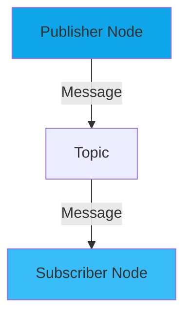

# Quickstart: Docusaurus Robotics Textbook

**Feature**: 002-docusaurus-robotics-textbook
**Purpose**: Get contributors up and running quickly with local development environment

## Prerequisites

### Required Software
- **Node.js**: 18.x or 20.x LTS ([Download](https://nodejs.org/))
- **Git**: Latest version ([Download](https://git-scm.com/))
- **Code Editor**: VS Code recommended ([Download](https://code.visualstudio.com/))

### Recommended VS Code Extensions
- ESLint
- Prettier - Code formatter
- MDX
- Markdown All in One
- Code Spell Checker

### Optional (for code example testing)
- **Docker**: For ROS 2 Humble environment ([Download](https://www.docker.com/))
- **Python**: 3.10+ (for local ROS 2 development)

## Quick Setup (5 minutes)

### 1. Clone Repository

```bash
git clone https://github.com/username/physical-ai-textbook.git
cd physical-ai-textbook
```

### 2. Install Dependencies

```bash
npm install
```

This installs:
- Docusaurus core and preset-classic
- React 18
- TypeScript
- Mermaid plugin for diagrams
- All development dependencies

### 3. Start Development Server

```bash
npm start
```

This command:
- Builds the site in development mode
- Starts local server at `http://localhost:3000`
- Opens browser automatically
- Enables hot reload (changes appear instantly)

**Expected Output**:
```
[INFO] Starting the development server...
[SUCCESS] Docusaurus website is running at: http://localhost:3000/
```

### 4. Verify Setup

Open browser to `http://localhost:3000` and check:
- ✅ Homepage loads correctly
- ✅ Sidebar navigation shows all chapters
- ✅ Dark/light theme toggle works
- ✅ At least one chapter is viewable
- ✅ Mermaid diagrams render (if any present)

## Project Structure

```text
physical-ai-textbook/
├── docs/                          # All textbook content (markdown)
│   ├── intro.md                   # Landing page
│   ├── week-01-02-intro-physical-ai/
│   │   ├── category.json          # Chapter sidebar config
│   │   ├── index.md               # Chapter overview
│   │   ├── 01-foundations.md      # Section 1
│   │   ├── 02-embodied-intelligence.md
│   │   ├── 03-sensor-systems.md
│   │   ├── 04-physical-vs-digital-ai.md
│   │   └── exercises.md
│   ├── week-03-ros2-part1/        # Similar structure
│   ├── week-04-ros2-part2/        # Similar structure
│   └── resources/
│       ├── glossary.md
│       └── setup-guide.md
│
├── src/                           # Custom React components
│   ├── components/
│   │   ├── HomepageFeatures/
│   │   │   ├── index.tsx
│   │   │   └── styles.module.css
│   │   └── CodeBlock/             # Custom code display (if needed)
│   ├── css/
│   │   └── custom.css             # Theme customization
│   └── pages/
│       ├── index.tsx              # Homepage component
│       └── index.module.css
│
├── static/                        # Static assets (not processed by webpack)
│   ├── img/
│   │   ├── logo.svg
│   │   ├── favicon.ico
│   │   └── social-card.png
│   └── robots.txt
│
├── docusaurus.config.ts           # Main configuration
├── sidebars.ts                    # Sidebar structure definition
├── package.json                   # Dependencies and scripts
├── tsconfig.json                  # TypeScript configuration
└── README.md                      # Project documentation
```

## Development Workflow

### Writing Content

#### 1. Create New Section

```bash
# Navigate to appropriate chapter directory
cd docs/week-03-ros2-part1/

# Create new section file
touch 05-new-topic.md
```

#### 2. Add Frontmatter

```markdown
---
title: "Your Section Title"
sidebar_label: "Short Label"
sidebar_position: 5
description: "Brief description for SEO and previews"
keywords: [ros2, topic, relevant, keywords]
---

# Your Section Title

Content starts here...
```

#### 3. Preview Changes

Save the file → Browser auto-refreshes → See changes instantly

### Code Examples

Use fenced code blocks with syntax highlighting:

````markdown
```python title="simple_node.py" showLineNumbers
import rclpy
from rclpy.node import Node

class SimpleNode(Node):
    def __init__(self):
        super().__init__('simple_node')
        self.get_logger().info('Node started!')

def main():
    rclpy.init()
    node = SimpleNode()
    rclpy.spin(node)
    rclpy.shutdown()
```
````

**Result**: Syntax highlighted Python code with line numbers and filename

### Diagrams with Mermaid

````markdown

````

**Result**: Interactive diagram rendered in browser

### Callout Boxes

```markdown
:::tip Key Concept
This is an important concept to remember!
:::

:::warning Common Pitfall
Avoid this mistake when implementing...
:::

:::note
Additional context or clarification.
:::

:::info
Helpful information for readers.
:::

:::danger
Critical warning - could cause errors!
:::
```

### Adding New Chapter

1. **Create directory**: `docs/week-05-new-chapter/`

2. **Create category.json**:
```json
{
  "label": "Week 5: Chapter Title",
  "position": 5,
  "description": "Brief chapter description",
  "collapsed": false,
  "link": {
    "type": "doc",
    "id": "week-05-new-chapter/index"
  }
}
```

3. **Create index.md** (chapter overview):
```markdown
---
title: "Week 5: Chapter Title"
sidebar_position: 0
---

# Chapter Overview

## Learning Objectives
- Objective 1
- Objective 2

## Prerequisites
- Prior knowledge needed

## Chapter Outline
- [Section 1](./01-section-name.md)
- [Section 2](./02-section-name.md)
```

4. **Add to sidebars.ts** (if not auto-detected):
```typescript
// sidebars.ts
{
  type: 'category',
  label: 'Week 5: Chapter Title',
  items: [
    'week-05-new-chapter/index',
    'week-05-new-chapter/01-section-name',
    'week-05-new-chapter/02-section-name',
  ],
}
```

## Available NPM Scripts

```bash
# Development
npm start              # Start dev server with hot reload
npm run build          # Production build
npm run serve          # Serve production build locally
npm run clear          # Clear cache (use if seeing stale content)

# Code Quality
npm run lint           # Lint TypeScript/JavaScript files
npm run format         # Format code with Prettier

# Deployment
npm run deploy         # Build and deploy to GitHub Pages (if configured)

# Custom Scripts (add as needed)
npm run validate-links # Check for broken links
npm run spell-check    # Run spell checker on markdown
```

## Testing Your Changes

### 1. Local Build Test

```bash
npm run build
```

**Check for**:
- ✅ Build completes without errors
- ✅ No console warnings about broken links
- ✅ Bundle size reasonable (<5MB total)

### 2. Serve Production Build

```bash
npm run serve
```

**Verify**:
- ✅ Site works at `http://localhost:3000`
- ✅ Navigation functions correctly
- ✅ Dark/light theme persists
- ✅ Search works (if enabled)

### 3. Accessibility Check

Open browser DevTools → Lighthouse tab → Run audit

**Target Scores**:
- Performance: 95+
- Accessibility: 95+
- Best Practices: 100
- SEO: 100

### 4. Mobile Testing

In browser DevTools:
- Toggle device toolbar (Ctrl+Shift+M / Cmd+Shift+M)
- Test at 360px width (iPhone SE)
- Test at 768px width (iPad)
- Verify navigation menu works
- Check code blocks are readable

## Testing ROS 2 Code Examples

### Setup ROS 2 Docker Environment

```bash
# Pull ROS 2 Humble image
docker pull osrf/ros:humble-desktop

# Run container with mounted workspace
docker run -it --rm \
  -v $(pwd)/code-examples:/workspace \
  osrf/ros:humble-desktop

# Inside container, test Python example
cd /workspace/week-03-ros2-part1/01-simple-publisher
python3 simple_publisher.py
```

### Validation Checklist

Before publishing code example:
- ✅ Code runs without errors in ROS 2 environment
- ✅ Code includes docstrings and comments
- ✅ Expected output matches documentation
- ✅ Error handling implemented where appropriate
- ✅ Code follows ROS 2 best practices

## Common Issues & Solutions

### Issue: "Port 3000 already in use"

**Solution**:
```bash
# Kill process on port 3000
npx kill-port 3000

# Or use different port
npm start -- --port 3001
```

### Issue: Changes not appearing after save

**Solution**:
```bash
# Clear Docusaurus cache
npm run clear

# Restart dev server
npm start
```

### Issue: Mermaid diagrams not rendering

**Solution**:
1. Verify `@docusaurus/theme-mermaid` is installed
2. Check docusaurus.config.ts includes mermaid in themes
3. Ensure mermaid code block uses triple backticks with `mermaid` language tag

### Issue: TypeScript errors in custom components

**Solution**:
```bash
# Check TypeScript configuration
npm run type-check

# Install missing type definitions
npm install --save-dev @types/react @types/react-dom
```

### Issue: Build fails with "Cannot find module"

**Solution**:
```bash
# Delete node_modules and reinstall
rm -rf node_modules package-lock.json
npm install
```

## Configuration Files

### docusaurus.config.ts

Key settings to understand:

```typescript
export default {
  title: 'Physical AI & Humanoid Robotics',
  tagline: 'From ROS 2 to Embodied Intelligence',

  // GitHub Pages deployment
  url: 'https://username.github.io',
  baseUrl: '/physical-ai-textbook/',
  organizationName: 'username',
  projectName: 'physical-ai-textbook',

  // Theme configuration
  themeConfig: {
    navbar: { /* ... */ },
    footer: { /* ... */ },
    prism: {
      theme: lightCodeTheme,
      darkTheme: darkCodeTheme,
      additionalLanguages: ['python', 'cpp', 'bash', 'yaml', 'xml'],
    },
    colorMode: {
      defaultMode: 'dark',
      respectPrefersColorScheme: true,
    },
  },
};
```

### sidebars.ts

Defines sidebar navigation structure:

```typescript
const sidebars: SidebarsConfig = {
  tutorialSidebar: [
    'intro',
    {
      type: 'category',
      label: 'Week 1-2: Physical AI',
      items: [
        'week-01-02-intro-physical-ai/index',
        'week-01-02-intro-physical-ai/01-foundations',
        // ... more items
      ],
    },
  ],
};
```

## Content Guidelines

### Markdown Best Practices

- **Headings**: Use proper hierarchy (h1 → h2 → h3, no skipping)
- **Links**: Use relative paths for internal links
- **Images**: Place in `static/img/` directory, reference as `/img/filename.png`
- **Code**: Always specify language for syntax highlighting
- **Frontmatter**: Required for all content pages

### Writing Style

- **Clarity**: Plain language, define jargon on first use
- **Active Voice**: "The publisher sends messages" vs "Messages are sent by the publisher"
- **Conciseness**: Target 8-12 minutes reading time per section
- **Examples**: Include concrete examples for abstract concepts
- **Exercises**: Provide clear success criteria

### Accessibility Requirements

- **Alt Text**: All images must have descriptive alt text
- **Headings**: Logical hierarchy for screen readers
- **Link Text**: Descriptive (avoid "click here")
- **Color**: Don't rely on color alone to convey meaning
- **Contrast**: Maintain 4.5:1 ratio minimum

## Getting Help

### Documentation Resources
- [Docusaurus Documentation](https://docusaurus.io/docs)
- [MDX Documentation](https://mdxjs.com/)
- [Mermaid Documentation](https://mermaid.js.org/)

### Project-Specific Help
- Check `specs/002-docusaurus-robotics-textbook/` for detailed planning docs
- Review existing chapters for content structure examples
- Consult `data-model.md` for entity definitions

### Community
- Open issue on GitHub repository
- Ask in project Discord/Slack (if available)
- Review closed issues for similar problems

## Next Steps

After completing quickstart:

1. **Read**: Review existing chapter content to understand style and structure
2. **Experiment**: Create a test section in a chapter to practice markdown and Mermaid
3. **Contribute**: Pick a content task from the project backlog
4. **Validate**: Run build and accessibility checks before committing

## Contributing Workflow

```bash
# 1. Create feature branch
git checkout -b content/week-03-new-section

# 2. Make changes
# ... edit files ...

# 3. Test locally
npm run build
npm run serve

# 4. Commit with conventional commit message
git add .
git commit -m "docs(week-03): add new section on ROS 2 parameters"

# 5. Push and create pull request
git push origin content/week-03-new-section
# Create PR on GitHub
```

## Performance Tips

### Development Mode
- Use `npm start` only for active development
- Close unused tabs to reduce memory usage
- Restart dev server if performance degrades

### Production Builds
- Optimize images before adding (use WebP format)
- Keep code examples concise (link to repository for full code)
- Limit Mermaid diagram complexity (<15 nodes)

### Caching
- Docusaurus caches aggressively for performance
- Use `npm run clear` if seeing stale content
- Production builds regenerate everything (no cache issues)

---

**Ready to build!** Start the dev server and begin creating educational content for Physical AI and robotics students. 🤖
