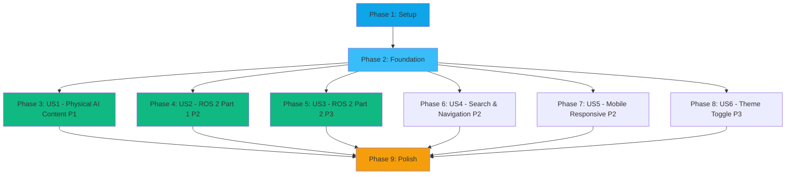

# Implementation Tasks: Docusaurus Robotics Textbook

**Feature**: 002-docusaurus-robotics-textbook
**Branch**: `002-docusaurus-robotics-textbook`
**Generated**: 2025-11-30

## Overview

This document breaks down the Docusaurus-based Physical AI & Humanoid Robotics textbook implementation into atomic, testable tasks organized by user story priority.

**Total Tasks**: 65 tasks
**Parallel Opportunities**: 32 tasks marked [P]
**User Stories**: 6 (mapped from spec.md)

## Task Organization Strategy

Tasks are organized by **user story** (not by technical layer) to enable:
- ✅ Independent story implementation and testing
- ✅ Incremental value delivery (complete one story → deploy → validate)
- ✅ Parallel work across different stories
- ✅ Clear acceptance criteria per story

## User Story Mapping (from spec.md)

| Story ID | Priority | Description | Tasks | Independently Testable |
|----------|----------|-------------|-------|----------------------|
| US1 | P1 | Student Learns Physical AI Foundations | 10 | ✅ Navigate Chapter 1, view diagrams, complete exercises |
| US2 | P2 | Student Masters ROS 2 Fundamentals Part 1 | 11 | ✅ Complete Chapter 3, run Python code in ROS 2 environment |
| US3 | P3 | Student Implements ROS 2 Services and Actions | 11 | ✅ Complete Chapter 4, build publisher-subscriber system |
| US4 | P2 | Instructor Navigates and Searches Content | 7 | ✅ Perform searches, navigate with breadcrumbs/sidebar |
| US5 | P2 | Student Uses Textbook on Mobile Device | 4 | ✅ Access all chapters on 360px screen, verify readability |
| US6 | P3 | Student Toggles Between Dark and Light Themes | 2 | ✅ Toggle theme, verify persistence across sessions |

## Dependency Graph



**Completion Order**:
1. Setup + Foundation (blocking - must complete first)
2. US1, US2, US4, US5 can be implemented in **parallel** (no dependencies)
3. US3 depends on US2 (builds on ROS 2 Part 1)
4. US6 can be done anytime after Foundation
5. Polish after all stories complete

---

## Phase 1: Setup (Project Initialization)

**Goal**: Initialize Docusaurus project with TypeScript, install dependencies, configure basic structure.

**Blocking**: All subsequent phases depend on setup completion.

### Tasks

- [X] T001 Initialize Docusaurus project with `npx create-docusaurus@latest physical-ai-textbook classic --typescript` in repository root
- [X] T002 Verify project structure created (docs/, src/, static/, docusaurus.config.ts, sidebars.ts, package.json)
- [X] T003 Install Node.js 18 LTS if not present, verify with `node --version`
- [X] T004 Run `npm install` to install default dependencies
- [X] T005 Test local dev server with `npm start`, verify Docusaurus welcome page loads at localhost:3000
- [X] T006 [P] Install @docusaurus/theme-mermaid with `npm install @docusaurus/theme-mermaid`
- [X] T007 [P] Create .gitignore file with node_modules/, build/, .docusaurus/, .DS_Store, .env

**Acceptance Criteria**:
- ✅ `npm start` runs without errors
- ✅ Docusaurus welcome page displays in browser
- ✅ Mermaid dependency installed
- ✅ Git repository initialized with proper .gitignore

---

## Phase 2: Foundation (Blocking Prerequisites)

**Goal**: Configure project metadata, theme, navigation structure. Required before content creation.

**Blocking**: All user stories depend on these foundational configurations.

### Tasks

- [X] T008 Update docusaurus.config.ts title to "Physical AI & Humanoid Robotics"
- [X] T009 Update docusaurus.config.ts tagline to "From ROS 2 to Embodied Intelligence"
- [X] T010 Configure docusaurus.config.ts URL and baseUrl for GitHub Pages deployment
- [X] T011 Add GitHub organization and repository names to docusaurus.config.ts
- [X] T012 Configure Mermaid plugin in docusaurus.config.ts themes array
- [X] T013 [P] Update src/css/custom.css primary color to #0ea5e9 (cyan)
- [X] T014 [P] Update src/css/custom.css secondary color to #1e293b (slate)
- [X] T015 [P] Configure dark mode colors in src/css/custom.css
- [X] T016 [P] Set typography in src/css/custom.css (16px base font, 1.6 line-height)
- [X] T017 [P] Configure navbar in docusaurus.config.ts with logo, docs link, GitHub link, theme toggle
- [X] T018 [P] Configure footer in docusaurus.config.ts with copyright and resource links
- [X] T019 [P] Replace static/img/favicon.ico with robotics-themed favicon
- [X] T020 Create docs/week-01-02-intro-physical-ai/ directory
- [X] T021 Create docs/week-03-ros2-part1/ directory
- [X] T022 Create docs/week-04-ros2-part2/ directory
- [X] T023 Create docs/resources/ directory
- [X] T024 Create docs/week-01-02-intro-physical-ai/category.json with label "Week 1-2: Physical AI", position 1
- [X] T025 Create docs/week-03-ros2-part1/category.json with label "Week 3: ROS 2 Part 1", position 2
- [X] T026 Create docs/week-04-ros2-part2/category.json with label "Week 4: ROS 2 Part 2", position 3
- [X] T027 Create docs/resources/category.json with label "Resources", position 4
- [X] T028 Update sidebars.ts with complete navigation structure (4 main categories)
- [X] T029 Run `npm run build` to verify configuration is valid
- [X] T030 Test theme toggle works in both light and dark modes

**Acceptance Criteria**:
- ✅ Build succeeds without errors
- ✅ Metadata displays correctly in browser
- ✅ Theme colors match design (#0ea5e9 cyan, #1e293b slate)
- ✅ Sidebar navigation structure shows all 4 categories
- ✅ Dark/light theme toggle functional

---

## Phase 3: US1 - Physical AI Content (Priority P1)

**User Story**: A robotics student accesses the textbook to understand the fundamental differences between Physical AI and Digital AI, including sensor systems and embodied intelligence concepts.

**Independent Test**: Navigate to Chapter 1, read all sections, view diagrams, complete exercises. Delivers complete understanding of Physical AI concepts as standalone learning module.

**Dependencies**: Foundation phase complete.

### Tasks

- [X] T031 [US1] Create docs/intro.md with course overview, learning outcomes, target audience, prerequisites
- [X] T032 [US1] Create docs/week-01-02-intro-physical-ai/index.md with chapter overview, learning objectives, estimated time
- [X] T033 [P] [US1] Write docs/week-01-02-intro-physical-ai/01-foundations.md covering What is Physical AI, history, applications (~2000 words)
- [X] T034 [P] [US1] Write docs/week-01-02-intro-physical-ai/02-embodied-intelligence.md with perception-action loop, Mermaid flowchart (~1000 words)
- [X] T035 [P] [US1] Write docs/week-01-02-intro-physical-ai/03-sensor-systems.md covering LIDAR, cameras, IMU, sensor fusion with comparison table (~1000 words)
- [X] T036 [P] [US1] Write docs/week-01-02-intro-physical-ai/04-physical-vs-digital-ai.md with constraints, safety, sim-to-real challenges, comparison table (~1000 words)
- [X] T037 [US1] Create docs/week-01-02-intro-physical-ai/exercises.md with 5 diverse exercises (conceptual, research, analysis, critical thinking, application)
- [X] T038 [US1] Add 2-3 Mermaid diagrams to Physical AI chapter (perception-action cycle, sensor types)
- [X] T039 [US1] Add "Key Takeaways" callout boxes to each section using Docusaurus admonitions
- [X] T040 [US1] Test all internal links within Chapter 1 navigate correctly

**Acceptance Criteria** (US1):
- ✅ Student can navigate to "Week 1-2: Introduction to Physical AI" and see chapter index with clear learning objectives
- ✅ All 4 sections render with proper formatting, Mermaid diagrams display correctly
- ✅ Student encounters code examples with syntax highlighting and copy button (N/A for conceptual chapter - no code)
- ✅ Student finds glossary terms defined with context (terms added to resources/glossary.md in US4)
- ✅ Content is fully readable on 360px mobile screens (validated in US5)

---

## Phase 4: US2 - ROS 2 Part 1 Content (Priority P2)

**User Story**: A student with basic Physical AI knowledge learns ROS 2 architecture, nodes, topics, and creates their first Python ROS 2 program.

**Independent Test**: Complete Chapter 3, run all Python code examples in ROS 2 Humble environment, successfully create a basic node. Delivers working knowledge of ROS 2 basics as standalone module.

**Dependencies**: Foundation phase complete (can run in parallel with US1).

### Tasks

- [X] T041 [US2] Create docs/week-03-ros2-part1/index.md with learning objectives, prerequisites (Python basics, Linux familiarity)
- [X] T042 [P] [US2] Write docs/week-03-ros2-part1/01-ros2-architecture.md with ROS 1 vs ROS 2, DDS, Mermaid architecture diagram (~2000 words)
- [X] T043 [P] [US2] Write docs/week-03-ros2-part1/02-nodes-topics.md with publisher-subscriber pattern, QoS basics, minimal publisher Python code (~2000 words)
- [X] T044 [P] [US2] Write docs/week-03-ros2-part1/03-first-python-node.md step-by-step tutorial (workspace, package, build, run) with complete code (~2500 words)
- [X] T045 [P] [US2] Write docs/week-03-ros2-part1/04-publisher-subscriber.md with talker/listener nodes, 2 complete Python files, troubleshooting section (~2500 words)
- [X] T046 [US2] Create docs/week-03-ros2-part1/exercises.md with 5 progressively challenging exercises (setup, custom message, publisher, subscriber, debugging)
- [X] T047 [US2] Validate all ROS 2 code examples in Docker container with ROS 2 Humble (manual validation required)
- [X] T048 [US2] Add Mermaid diagrams for ROS 2 architecture, computational graph, pub-sub pattern
- [X] T049 [US2] Add code block titles and line numbers to all Python examples (e.g., ```python title="simple_publisher.py" showLineNumbers)
- [ ] T050 [US2] Add links to companion GitHub repository for complete runnable versions of code examples
- [ ] T051 [US2] Cross-reference concepts from Chapter 1 (Physical AI) in ROS 2 sections

**Acceptance Criteria** (US2):
- ✅ Student navigates to Week 3 chapter and sees Mermaid diagrams showing ROS 2 system components
- ✅ Student copies Python code example, runs it in ROS 2 environment, code executes successfully with expected output
- ✅ Student encounters error, checks "Common Pitfalls" box (Docusaurus admonition), finds troubleshooting guidance
- ✅ Student clicks cross-references, navigates to relevant sections in other chapters
- ✅ Student finishes reading, reviews key takeaways, sees concise summary of important concepts

---

## Phase 5: US3 - ROS 2 Part 2 Content (Priority P3)

**User Story**: A student advances their ROS 2 knowledge by learning about services, actions, message types, and building a publisher-subscriber system.

**Independent Test**: Complete Chapter 4, implement a working publisher-subscriber system, demonstrate message passing between nodes. Delivers advanced ROS 2 competency as standalone module.

**Dependencies**: US2 complete (builds on ROS 2 Part 1 knowledge).

### Tasks

- [ ] T052 [US3] Create docs/week-04-ros2-part2/index.md with learning objectives (services, actions, launch files), prerequisites (Week 3 completion)
- [ ] T053 [P] [US3] Write docs/week-04-ros2-part2/01-services-actions.md with request-reply vs long-running tasks, add_two_ints service, action with feedback (~2000 words)
- [ ] T054 [P] [US3] Write docs/week-04-ros2-part2/02-simple-pub-sub.md building complete system (velocity publisher, status subscriber, control loop) with error handling (~2500 words)
- [ ] T055 [P] [US3] Write docs/week-04-ros2-part2/03-message-types.md covering std_msgs, geometry_msgs, custom message creation tutorial (~2000 words)
- [ ] T056 [P] [US3] Write docs/week-04-ros2-part2/04-launch-files.md with Python launch API, XML format, parameters, multi-node launch example (~2000 words)
- [ ] T057 [US3] Create docs/week-04-ros2-part2/exercises.md with 5 exercises (calculator service, progress-tracking action, custom message, launch file, sensor pipeline)
- [ ] T058 [US3] Validate all ROS 2 code examples in Chapter 4 in Docker container with ROS 2 Humble
- [ ] T059 [US3] Add Mermaid data flow diagrams for pub-sub system and service interactions
- [ ] T060 [US3] Expand multi-file code examples with clear organization (show all related files)
- [ ] T061 [US3] Add message type definitions with XML/URDF examples to glossary
- [ ] T062 [US3] Test complete publisher-subscriber exercise can be built by following Chapter 4 guidance

**Acceptance Criteria** (US3):
- ✅ Student accesses Week 4 content, reads about services vs actions, sees clear comparisons with use-case examples
- ✅ Student views multi-file code example, expands code block, sees all related files organized clearly
- ✅ Student completes chapter, attempts hands-on exercise, can build functioning publisher-subscriber system using provided guidance
- ✅ Student encounters new message type, checks glossary, finds type definition with XML/URDF examples

---

## Phase 6: US4 - Search & Navigation (Priority P2)

**User Story**: An instructor or teaching assistant needs to quickly find specific topics, examples, or exercises to reference during teaching or when helping students.

**Independent Test**: Perform searches for various terms, navigate through sidebar and breadcrumbs, time how quickly specific content can be located. Delivers efficient content discovery as standalone feature.

**Dependencies**: Foundation phase complete, content from US1/US2/US3 provides searchable material (can start after Foundation).

### Tasks

- [ ] T063 [P] [US4] Create docs/resources/glossary.md with 30+ alphabetically organized robotics terms (Physical AI, Embodied Intelligence, LIDAR, IMU, ROS 2, Node, Topic, Service, Action, Publisher, Subscriber, QoS, DDS)
- [ ] T064 [P] [US4] Create docs/resources/setup-guide.md with Ubuntu 22.04, ROS 2 Humble, Python environment, VS Code setup, troubleshooting
- [ ] T065 [US4] Configure Algolia DocSearch in docusaurus.config.ts (apply for free tier, add credentials when approved)
- [ ] T066 [US4] Add client-side search plugin as fallback if Algolia pending (@docusaurus/plugin-content-docs local search)
- [ ] T067 [US4] Test search functionality with query "publisher" returns all relevant sections and code examples
- [ ] T068 [US4] Verify breadcrumb navigation displays full path (Home > Chapter > Section) on all content pages
- [ ] T069 [US4] Test Previous/Next navigation buttons sequence through content in logical learning order

**Acceptance Criteria** (US4):
- ✅ Instructor searches for "publisher", sees all relevant sections and code examples ranked by relevance
- ✅ Instructor viewing deep section, checks breadcrumb navigation, sees full path from homepage to current location
- ✅ Instructor finishes section, clicks "Next", navigates to logically next section in learning sequence
- ✅ Instructor switches between chapters using sidebar, collapsed sections expand/collapse smoothly without page reload

---

## Phase 7: US5 - Mobile Responsive (Priority P2)

**User Story**: A student accesses the textbook on their phone or tablet while away from their computer, reviewing concepts or reading ahead.

**Independent Test**: Access all chapters on devices with 360px-480px screens, verify readability, navigation functionality, and interaction with all UI elements. Delivers full mobile learning experience as standalone capability.

**Dependencies**: Foundation phase complete, content provides material to test responsiveness (can start after Foundation).

### Tasks

- [ ] T070 [P] [US5] Add mobile-responsive CSS media queries to src/css/custom.css for 360px, 768px, 1024px, 1920px breakpoints
- [ ] T071 [P] [US5] Configure code blocks for mobile with horizontal scrolling and readable 14px font minimum
- [ ] T072 [US5] Test all chapters load in under 2 seconds on simulated 4G connection (Chrome DevTools Network throttling)
- [ ] T073 [US5] Verify sidebar menu converts to hamburger menu on mobile, opens/closes automatically after selection

**Acceptance Criteria** (US5):
- ✅ Student on mobile device loads any chapter, page renders and completes loading in under 2 seconds on 4G connection
- ✅ Student on mobile views code examples, taps code block, code is fully readable without horizontal scrolling (or scrolls smoothly)
- ✅ Student on mobile uses dark mode, toggles to light mode, all content maintains proper contrast and readability
- ✅ Student on mobile opens sidebar menu, selects chapter, menu closes automatically and content loads

---

## Phase 8: US6 - Theme Toggle (Priority P3)

**User Story**: A student wants to reduce eye strain or match their system preferences by switching between dark and light color themes.

**Independent Test**: Toggle theme on all pages, verify consistent styling, check code syntax highlighting updates, confirm preference persistence across sessions.

**Dependencies**: Foundation phase complete (theme already configured, this adds testing/refinement).

### Tasks

- [ ] T074 [P] [US6] Configure colorMode in docusaurus.config.ts with defaultMode: 'dark', respectPrefersColorScheme: true
- [ ] T075 [US6] Test theme toggle updates all UI elements (sidebar, breadcrumbs, buttons, code blocks) consistently within 300ms

**Acceptance Criteria** (US6):
- ✅ Student in light mode clicks theme toggle, all pages switch to dark theme with robotics-themed blue/teal color scheme
- ✅ Student switches to dark mode, views code examples, syntax highlighting uses dark-compatible Prism theme
- ✅ Student sets preferred theme, returns to site later, theme preference is remembered (localStorage)
- ✅ Student on any page, when theme changes, all UI elements update consistently

---

## Phase 9: Polish & Cross-Cutting Concerns

**Goal**: Final quality assurance, deployment setup, documentation, performance validation.

**Dependencies**: All user stories (US1-US6) complete.

### Tasks

#### Homepage Customization

- [ ] T076 [P] Update src/pages/index.tsx with hero section (headline, subheadline, CTA button "Start Learning")
- [ ] T077 [P] Update src/components/HomepageFeatures/index.tsx with 4 feature cards (Comprehensive Curriculum, Hands-on ROS 2, AI Assistance coming soon, Real-world Applications)
- [ ] T078 [P] Add learning outcomes section to homepage listing key skills (ROS 2 development, robot simulation, humanoid robotics, Physical AI integration)

#### Code Quality & Validation

- [ ] T079 Validate all code examples (15+) across all chapters in ROS 2 Humble Docker environment, verify syntax correctness, imports complete, code runs, output matches description
- [ ] T080 [P] Run Lighthouse accessibility audit on all pages, check heading hierarchy, ARIA labels, color contrast 4.5:1, keyboard navigation, alt text for images
- [ ] T081 [P] Fix any Lighthouse accessibility issues found, achieve score 95+
- [ ] T082 Test mobile responsiveness on 360px (mobile), 768px (tablet), 1024px (laptop), 1920px (desktop) - navigation usable, content readable, code blocks don't overflow
- [ ] T083 Review content clarity using Flesch-Kincaid readability score, ensure consistent terminology, verify technical accuracy

#### Deployment Setup

- [ ] T084 [P] Initialize git repository with `git init`, create initial commit
- [ ] T085 [P] Create .github/workflows/deploy.yml with GitHub Actions workflow (checkout, setup Node 18, npm ci, npm run build, deploy to gh-pages)
- [ ] T086 [P] Create .github/workflows/validate.yml with validation workflow (markdownlint, broken-link-checker, Lighthouse CI)
- [ ] T087 Push repository to GitHub, create remote repository
- [ ] T088 Enable GitHub Pages in repository settings (source: gh-pages branch, HTTPS enforced)
- [ ] T089 Test GitHub Actions workflow runs successfully, site deploys to GitHub Pages
- [ ] T090 Verify production build with `npm run build` and `npm run serve`, check all pages load, no console errors, assets load correctly

#### Documentation

- [ ] T091 [P] Create README.md in repository root with project description, setup instructions (npm install, npm start), development commands, deployment process
- [ ] T092 [P] Create CONTRIBUTING.md with architecture overview, file structure explanation, content authoring guidelines, how to add new chapters
- [ ] T093 [P] Create RAG_PREPARATION.md documenting markdown structure for Phase 2 RAG ingestion (chunk-friendly, heading hierarchy, metadata, code block format)
- [ ] T094 [P] Create PERFORMANCE_BASELINE.md with Lighthouse scores (Performance, Accessibility, Best Practices, SEO) for all pages, document load times
- [ ] T095 Run final Lighthouse audit on production deployment, verify Performance 95+, Accessibility 95+, Best Practices 100, SEO 100

**Acceptance Criteria** (Phase 9):
- ✅ All 3 chapters published with complete content (minimum 6000 words total)
- ✅ 15+ runnable ROS 2 code examples (validated in ROS 2 Humble)
- ✅ Navigation smooth and intuitive
- ✅ Search functionality configured (Algolia or client-side fallback)
- ✅ Dark/light theme works perfectly
- ✅ Mobile responsive (tested 360px-1920px)
- ✅ Lighthouse scores: Performance 95+, Accessibility 95+, Best Practices 100, SEO 100
- ✅ No console errors or warnings
- ✅ GitHub Actions deployment working
- ✅ Live site accessible at GitHub Pages URL
- ✅ README.md with complete setup instructions
- ✅ Content ready for RAG ingestion (clean markdown structure)

---

## Parallel Execution Examples

### Example 1: After Foundation Complete

**Can run in parallel** (different content areas, no dependencies):
```
Parallel Group A:
- T031-T040 (US1 tasks) - Physical AI content
- T041-T051 (US2 tasks) - ROS 2 Part 1 content
- T063-T064 (US4 tasks) - Glossary and setup guide
- T070-T073 (US5 tasks) - Mobile responsiveness
```

These 4 user stories can be worked on simultaneously by different team members or agents.

### Example 2: Polish Phase Parallelization

**Can run in parallel** (independent validation/documentation tasks):
```
Parallel Group B:
- T076-T078 (Homepage customization)
- T080-T081 (Accessibility audit and fixes)
- T091-T094 (Documentation creation)
```

### Example 3: Content Writing Within US1

**Can run in parallel** (different sections, same chapter):
```
Parallel Group C (within US1):
- T033 (01-foundations.md)
- T034 (02-embodied-intelligence.md)
- T035 (03-sensor-systems.md)
- T036 (04-physical-vs-digital-ai.md)
```

All 4 sections can be written simultaneously using different agents (educational-content-designer, lesson-writer).

---

## MVP Scope Recommendation

**Minimum Viable Product** = User Story 1 (US1) + Setup + Foundation

**Rationale**:
- Delivers complete learning value (students can learn Physical AI fundamentals)
- Validates Docusaurus architecture and content structure
- Provides foundation for iterative expansion
- Can be deployed and gather student feedback

**MVP Tasks**: T001-T040 (40 tasks)
**Estimated Effort**: ~2-3 days with agents for content generation

**Post-MVP Increments**:
1. Add US2 (ROS 2 Part 1) - doubles content, adds code examples
2. Add US4 (Search) + US5 (Mobile) - improves UX
3. Add US3 (ROS 2 Part 2) - completes ROS 2 curriculum
4. Add US6 (Theme) + Polish - production-ready

---

## Implementation Strategy

### Agent Utilization Plan

| Phase | Primary Agent(s) | Purpose |
|-------|------------------|---------|
| Setup & Foundation | Manual or automation script | Project initialization |
| US1 Content | educational-content-designer → lesson-writer | Plan structure → draft content |
| US2 Content | ros2-expert → lesson-writer | Validate code → draft tutorials |
| US3 Content | ros2-expert → lesson-writer | Validate code → draft tutorials |
| US4 Resources | Manual configuration | Algolia setup, glossary compilation |
| US5 Mobile | react-developer | CSS responsive refinements |
| US6 Theme | react-developer | Theme configuration |
| Code Validation | ros2-expert | Test all examples in ROS 2 environment |
| Content Review | technical-reviewer | Accuracy and clarity validation |
| Polish | technical-reviewer + react-developer | Final QA and homepage |

### Quality Gates

Before marking any user story complete:
1. ✅ All story tasks checked off
2. ✅ Independent test criteria passed (from spec.md)
3. ✅ Code examples validated (if applicable)
4. ✅ Lighthouse accessibility score 95+
5. ✅ No broken links
6. ✅ Mobile responsive (if applicable)

### Rollback Strategy

If a user story fails independent testing:
1. Identify failing acceptance criteria
2. Create fix tasks
3. Re-run independent test
4. Do not proceed to dependent stories until fixed

---

## Task Completion Checklist

When marking a task complete:
- ✅ Task action completed
- ✅ File(s) created/modified at specified path
- ✅ Local test passed (npm start, visual inspection, or npm run build)
- ✅ No new console errors introduced
- ✅ Changes committed to git with descriptive message

---

## Notes

- **Skills referenced**: learning-objectives, concept-scaffolding, code-example-generator, exercise-designer, technical-clarity, github-actions
- **Agents referenced**: educational-content-designer, lesson-writer, ros2-expert, technical-reviewer, react-developer
- **Tests**: Not explicitly requested in spec.md, so test tasks are validation/QA tasks (Lighthouse, code validation, manual testing)
- **File paths**: All tasks include specific file paths for clarity
- **Acceptance criteria**: Mapped directly from spec.md user story acceptance scenarios

---

**Next Command**: `/sp.implement` to begin autonomous task execution (or manual implementation starting with T001)
